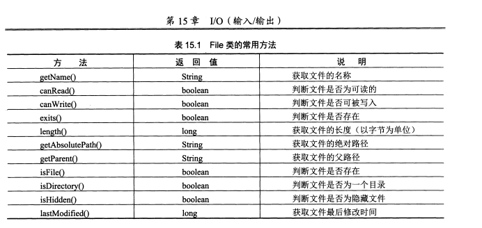
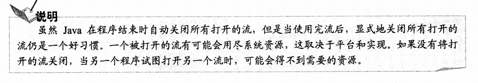
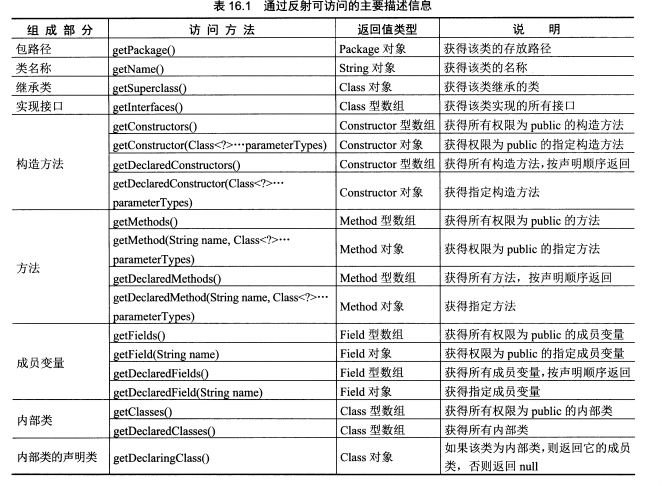
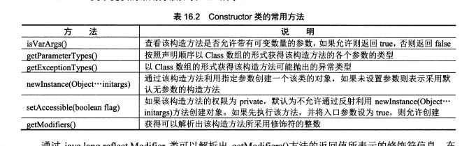
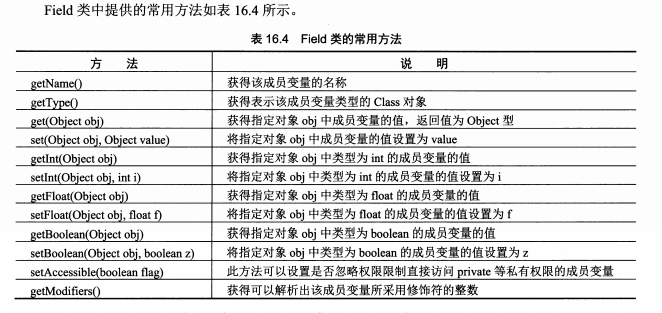
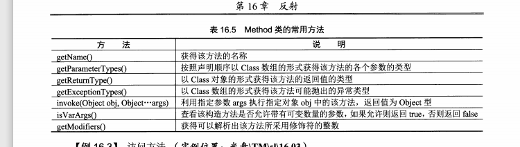

# JAVA复习02 IO

### 一、I/O流

##### 1.流概述

流是一组有序的数组序列，根据操作的类型，可分为输入流和输出流两种。虽然I/O流通常与磁盘文件存取有关，但是程序的源和目的地也可以说键盘，鼠标，内存或显示器窗口等。

##### 2.输入/输出流

Java语言定义了许多类专门负责各种方式的输入/输出，这些类都被放在java.io包中。其中，所有输入流类都是抽象类InputStream(字节输入流)或抽象类Reader（字符输入流）的子类；而所有输出流都是抽象类OutputStream（字节输出流）或抽象类Writer（字符输出流）的子类。

##### 3.File类

File类时java.io包中唯一代表磁盘文件本身的对象。可以通过调用File类中的方法，实现创建、删除、重命名文件等操作。File类的对象主要用来回去文件本身的一些信息。

```
new File(String pathname);/、pathname指路径名称（包含文件名）
```

```
new File(String parent,String child);//parent;父路径字符串。例如：D：/或D：/doc；child：子路径字符串。例如，letter.txt
```

```
new File(File f,String child);//f:父路径对象。例如，D：/doc/。；child：子路径字符串。例如，letter.txt
```

如果构造方法中的参数中并没有对应路径的文件名的话，可以使用`file.createNewFile()`创建这个文件，但必须要把它写在try-catch里面。



##### 4.FileInputStream与FileOutputStream

1.输入流：就是以程序为中心点，硬盘上的文件内容流入到程序中可以存储数据的东西中比如说数组，用read方法

2.输出流：就是以程序为中心点，程序中的数组或者其他的可以存储数据的东西中的内容输出到硬盘文件中，用write方法，需要用flush方法刷新一下，确保程序中的数组内容写出到硬盘文件中
FileOutputStream

```
public class Filetest{
    public static void main(String[] args){
        File file = new File("word.txt");
        try{
            FileOutputStream outfile = new FileOutputStream(file);
            byte a[] = "吼吼吼".getBytes();
            outfile.write(a);
            outfile.close();
        }catch(Exception e){
            e.printStackTrace();
        }
    }
}
```

FileInputStream

```
public class Filetest{
    public static void main(String[] args){
        File file = new File("world.txt");
        FileInputStream inputfile = null;//增大作用域
        try{
        	inputfile = new FileInputStream("world.txt");
            byte a[] = new byte[200];
            int len = inputfile.read(a);
            System.out.println("文件的内容是:"+new String(a,0,len));
            inputfile.close();
        }
        catch(Exception e){
            e.printStackTrace();
        }
    }
}
```



##### 5.FileReader与FileWriter

##### 6.BufferedInputStream与BufferedOutputStream

1.BufferedInput Stream类可以对所有InputStream类进行带缓存区的包装已达到性能的优化。BufferedInputStream有两个构造方法：

```
BufferedInputStream（InputStream in）;
BufferedInputStream（InputStream in,int size）。
```

第一个形式的构造 方法创建了一个带有32个字节的缓存流；第二种形式的构造方法按指定得到大小来创建缓存区。

## Java的反射机制

1.通过Java反射机制，可以在程序中访问已经装载到JVM中的Java对象的描述，实现访问，检测和修改描述Java对象本身信息的功Java.lang.reflect包中提供了对该功能的支持。

2.众所周知，所有的Java类均继承Object类，在Object类中定义了一个getClass()方法，该方法返回了一个类型为Class的对象。

```
Class textFieldC =  textField.getClass();//textFieldC是另一个对象。
```

而利用Class类的对象textFieldC，可以访问用来返回该对象的textField对象的描述信息。主要方法如下。



注：在通过getFields()和getMethods()方法一次获得权限为public的成员变量和方法时，将包含从超累中继承到的成员变量和方法，而通过方法getDeclaredFields()和getDeclareedMethods()只是获得本类中定义的所有成员变量和方法。

#####访问构造方法

1.在通过下列一组方法访问构造方法时，将返回Constructor类型的对象或数组。每个Constructor对象代表一个构造方法，利用Constructor对象可以操纵相应的构造方法。

```
getConstructors()。
getConstructor(Class<?>...parameterTypes)。
```

如果是访问指定的构造方法，需要根据构造方法的入口参数的类型来访问。如：

```
objectClass.getDeclaredConstructor(String.class,int.class);
objectClass.getDeclaredConstructor(new Class[]{String.class,int.class});
```



2.访问调用构造方法 

（1）通过类对象调用newInstance()方法。适用于无参构造方法

如：String.class.newInstance();

```
testClass tc = testClass.class.newwInstance();

testClass ta = new testClass();
testClass tc1 = ta.getClass().newInstance();

Class c = Class.forName("testClass");
testClass tc2 = (testClass)c.newInstance();
//此效果等同于testClass.getClass().newInstance();
```

（2）通过类对象的getConstructor()或getDeclaredConstructor()方法获得构造器（Constructor）对象并调用newInstance()方法创建对象。适用于无参和有参构造方法。

如：String.class.getConstructor(String.class).newInstance("Hello");

```
Class[] classes = new Class[]{String.class,int.class};
testClass tc3 = testClass.class.getConstructor(classes).newInstance("Hello",10);

testClass tc4 = testClass.getClaass().getDeclareedConstructor(String.class).newInstance("hello");

testClass tc4 = (testClass)Class.forName("testClass").getConstructor().newInstance();
```

3.访问成员变量

利用Field对象操纵相应成员变量

```
getFields();
getField(String name);
getDeclaredFields();
getDeclaredField(String name);
```

(1)通过该成员变量名称访问

```
object.getDeclaredField("birthday");
```



**以上的obj对象都是实例化的对象**（如：testClass类）

3.访问方法

在通过下列一组方法访问方法时，将返回Method类型的对象或数组。每个Method对象代表一个方法。利用Method对象可以操纵相应的方法。

```
getMethods();
getMethod(String name,Class<?>...parameterTypes);
getDeclaredMethods();
getDeclaredMethods(String name,Class<?>...parameterTypes);
```



**注意：如果想使用setAccessible设置访问权限。那么获取成员变量或者方法的话要使用DeclaredField()的方法获取.(Declared)**