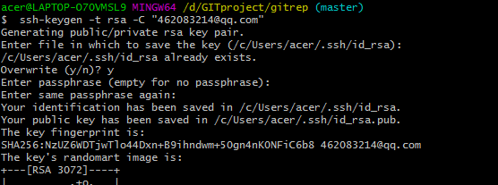
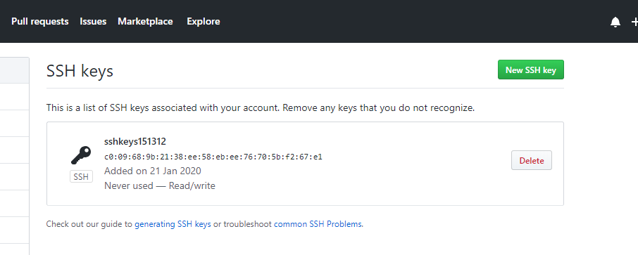
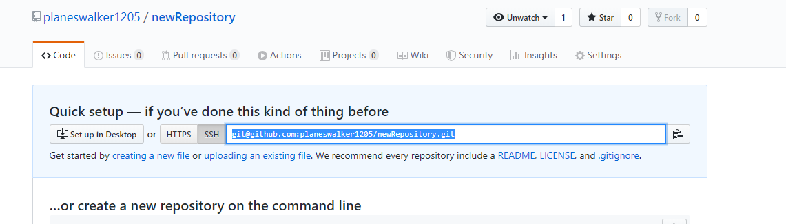

**网页无法访问GitHub网站的解决办法:**

进入Window下目录：C：\ Windows \ System32 \ drivers \ etc

notepad++打开hosts文件,在末尾添加如下代码:

```
#github 
192.30.253.113 github.com 
192.30.253.113 github.com 
192.30.253.118 gist.github.com 
192.30.253.119 gist.github.com
```

*此方法来自博客:* [https://blog.csdn.net/weixin_39087263/article/details/84493188](https://blog.csdn.net/weixin_39087263/article/details/84493188)

## 如何使用ssh密钥 ##

初次使用git的用户要使用git协议大概需要三个步骤:

*  生成密钥对

	1. ssh公钥默认存储在账户的主目录下的~/.ssh目录，查看:
	
	```
	$ cd~/.ssh
	$ ls
  	authorized_leys2 id_dsa		known_hosts config		id_dsa.pub
	```
	查看是否存在id_rsa和id_rsa.pub(id_dsa和id_dsa.pub之类成对的文件.)。
	
	`.pub`后缀的文件为公钥，另一个文件时密钥。
	
	2. 如果没有上述文件，没有.ssh目录，可以使用ssh-keygen创建
	
	```
	$ ssh-keygen -t rsa -C "email@email.com"

	Creates a new ssh key using the provided email # Generating public/private rsa key pair.

	Enter file in which to save the key (/home/you/.ssh/id_rsa):
	```
	直接enter，然后输入密码。
	
	
* 设置远程仓库上的公钥

	1. 查看生成的公钥:
	
	```key
	$ cat ~/.ssh/id_rsa.pub
	
	ssh-rsa AAAAB3NzaC1yc2EAAAADAQABAAABgQDBGTYBoVSyZsK0FyYuL3u5ATxwaETtplLsejKsj76G9ca1Bx519YLZCzY6zFnaD/2jYEZv1/IUjNxHWWRqP47zWTdQvdvSfPOheIp1j+mbA0HWPtCIi4c8vX3XWSv90uDoyzllMT3Qwi1XAn3TdcthLxIXKIb0v70ZdmXcl5t3t68BQfhrB/ykL4m6Nji0qPdTOtYwNYT0FH/n8Wvb7wBd8w1BJ6YNUZzyWkWLHFcF+hvXpaM4w5A0P7M880xsYROnyMB57WSejp1Dcp69KAp0WpjV5CPXsMgyvwEQ/aYKTYw06EAVUMavDTDTOZ9/I08P0R9X07HG+V99pB2r74f7AC2vvuglTLC4OT0hc3ZuyGYX3ATasv4og46sJJY46q65WUEyVvfNF6+QVRV8j9scy/OyjzrEQqXOjFVaxx7RE7LgcVvLhNRnartavD7Ll+4wMNDdiWqD88EBe8p3nbtl4/5Eu5w35BWm0AJg3jSykT643lOD0LJVSXIzyHkXST0= 462083214@qq.com
	```
	2. 登录GitHub账户，点击头像，Settings--SSH and GPG kets--New SSH key。

	3. 把命令行查看的密钥复制粘贴进去，记得要把前面的`ssh-rsa`一块复制进去，title随便填，最后点击Add key。

	

	4. 验证key是否正常工作
	

	```
	$ ssh -T git@github.com

	Attempts to ssh to github
	```
	
	这里可能会让你输入密码。
	
	最后，如果看到`Hi xxx! You've successfully authenticated, but GitHub does not # provide shell access.`则代表已经设置成功！
	

* 把git的remote url修改为git协议

	1. 使用命令git remote -v查看当前remote url

	```
	$ git remote -v
	origin https://github.com/someaccount/someproject.git (fetch)
	origin https://github.com/someaccount/someproject.git (push)
	```

	若是以上结果说明此项目是使用https协议进行访问的.(如果地址是git开头则表示是git协议).且只有是SSH URL的链接我们才能推送数据上去。

	2. 使用命令`git remote set-url`来调整url
	
	`git remote set-url origin git@github.com:planeswalker1205/newRepository.git`

	最后再使用`git remote -v查看`

	

## 远程仓库 ##

**添加远程仓库**

1. 登录GitHub，创建一个新的仓库，仓库名称叫newRepository。

2. 本地仓库运行如下命令:

```Linux
git remote add origin git@git.com:planewalker1205/newRepository.git
```

> 以上命令中:**gitrep**：远程仓库名称，默认可以叫origin，一看就可以知道是远程仓库，**planewalker1205**是你的GitHub用户名名称，**newRepository.git**是GitHub上创建的仓库的名称。再次强调只有SSH URL的链接(也就是git开头)我们才可以推送数据上去。

3. 将本地数据推送到远程仓库

`$ git push -u origin master`

> 由于远程库是空的，我们第一次推送`master`分支时，加上了-u参数。Git不但会把本地的`master`分支内容推送到远程新的`master`分支，还会把本地的`master`分支和远程的`master`分支关联起来，在以后的推送或者拉取时就可以简化命令。`$ git push origin master`

**删除指定的远程仓库**

`git remote rm origin`

## 分支的创建与合并 ##

注意:

> 在使用分支时要注意，各分支之间工作区与暂存区是公共的，所以在一个分支的工作区修改的内容如果未add或commit就切换到另一个分支那么这些修改的内容也会被带到另一个分支。只有在一个分支中把内容提交另一个分支的工作区的内容才会更改回原来的状态。如果一个分支的内容已经作出修改并提交，而在另一个分支的工作区修改内容，再从另一个分支切换到已经修改并提交的分支时是不允许的。可以使用git stash命令处理相关问题。

即:

> 当前创建了a分支，a分支有文件a.txt，然后创建并切换到b分支，同样的b分支会自动生成a.txt，那么此时如果在b分支修改a.txt的内容，然后切换到a分支，b分支修改后的内容会带到a分区，在然后无论是提交修改后的a分支的内容还是提交修改后的b分支的内容，最终没被提交的哪一个分支的内容会自动回退到被修改之前的状态。

> 接上。如果a分支或者b分支的对应文件内容作出了修改并且提交，那么无论是在a分支还是在b分支修改工作区的对应文件的内容并且不commit，那么切换到另一个分支（a或者b）都是Git不允许的。反之，如果没有修改分支的对应文件的内容而只是新建了其他的文件，那么切换分支参考上一个tips。

**对于刚创建的新分支，只有两个分支都有修改才提交后才判断同一个文件作出不同的修改操作的冲突。而对于新创建一个分支b只修改其中一个分支a/b并且提交，那么在另一个分支a合并(修改并提交的分支)b，另一个分支a会被(修改并提交的分支)b覆盖。**

- 创建分支

`$ git checkout -b dev`

> 上述命令表示创建并切换到分支dev，等同下列命令:

`$ git branch dev`

`$ git checkout dev`

使用`$ git branch`查看当前分支

```
$ git branch
* dev
  master
```

> *号表示当前在哪个分支。

- 合并分支

```
$ git branch
* master
  dev
```

`$ git merge dev`

> 表示把dev分支合并到master分支上

合并完成后，就可以删除dev分支:

`$ git branch -d dev`

如果报错的话可能是因为当前的分支还没有合并提示你并不能删除。此时，如果想要强制删除的话可以使用大写的D

`$ git branch -D dev`

再次查看分支，可以看到只剩下`master`分支了。

```
$ git branch
* master
```

- switch切换分支

`$ git switch -c dev`等同于`$ git checkout -b dev`

`$ git switch master`等同于`$ git checkout master`

**解决冲突**

1. 创建dev分支

```
$ git switch -c dev
```

2. 修改test.txt内容并提交

```
$ cat test.txt

dev test.txt

$ git add test.txt

$ git commit -m "dev commit"
```

3. 切换到master分支，修改test.txt内容并提交

```
$ cat test.txt

master test.txt

$ git add test.txt

$ git commit -m "master commit"
```

4. 合并dev分支

```
$ git merge dev

Auto-merging readme.txt
CONFLICT (content): Merge conflict in readme.txt
Automatic merge failed; fix conflicts and then commit the result.
```

> 可以看到如果两个分支的同一个文件的不同位置都有修改且提交的话，再次合并就会发生冲突。必须手动解决冲突后才能提交。

----

合并分支默认会使用`Fast forward`模式，该模式下如果删除分支会丢失分支信息。如果要禁用`Fast forward`模式，Git就会在merge时生成一个新的commit。

`git merge --no-ff -m "merge with no-ff" dev`

使用`git log`查看分支历史

```
$ git log --graph --pretty=oneline --abbrev-commit
*   e1e9c68 (HEAD -> master) merge with no-ff
|\  
| * f52c633 (dev) add merge
|/  
*   cf810e4 conflict fixed
```

在不使用`Fast forward`模式，merge后就会像这样。


如果你在一个分支dev上工作许久，此时需要紧急切换到另一个分支，但你还并不想提交当前工作的分支的内容，那么你就可以使用`stash`命令，把当前工作现场"储藏"起来，等以后恢复现场后继续工作。

`$ git stash`

现在，用`git status`查看工作区，就是干净的。可以放心创建或者切换到别的分支而不受本分支的影响。

当你处理完别的分支上的事情，切换到了之前工作并使用`stash`命令储藏工作内容的dev分支上。使用`git stash list`命令查看储藏起来的工作现场。

```
$ git stash list
stash@{0}: WIP on dev: f52c633 add merge
```

想要恢复工作现场。有两种办法。

1. 使用`git stash apply`命令。使用此命令在恢复后stash内容并不会删除。需要使用`git stash drop`命令来删除。

2. 使用`git stash pop`，使用此命令在恢复的同时也会把stash的内容删除。

再使用`git stash list`命令就看不到任何stash内容了。

> 当你在master分支上修复了bug后，由于dev分支时早期从master分支分出来的，所以，此bug也存在于dev分支。如果想在dev分支上修复同样的bug，除了可以重复操作一次再提交外。还有一种方法，只需要把在master上`4c805e2 fix bug 101`这个提交所做的修改“复制”到dev分支上。注意，此处是复制，而不是merge合并。

`$ git cheery-pick 4c805e2` 

此时，Git自动给dev分支做了一次提交。而这次提交的commitID是`1d4b803`，虽然它们的改动相同，但提交的commitID不同。

**多人协作**

当你从远程仓库克隆时，实际上Git自动把本地的master分支和远程的master分支对应起来了，并且，远程仓库的默认名称是origin。

要查看远程库的信息，用git remote：.

```
$ git remote
origin
```

或者，使用`git remote -v`查看更详细的信息。

```
$ git remote -v
origin  git@github.com:planewalker1205/newRepository.git (fetch)
origin  git@github.com:planewalker1205/newRepository.git (push)
```

上面显示的是可以抓取的`origin`的地址，如果没有推送权限的话，是看不到push的地址的。

- 推送分支

`$ git push origin master`

- 推送其他分支

`$ git push origin dev`

但是，并不是一定要把本地分支往远程推送，那么，哪些分支需要推送，哪些不需要呢？

1. `master`分支是主分支，因此要时刻与远程同步；

2. `dev`分支是开发分支，团队所有成员都需要在上面工作，所以也需要与远程同步；

3. `bug`分支只用于在本地修复bug，就没必要推到远程了，除非老板要看看你每周到底修复了几个bug；

4. `feature`分支是否推到远程，取决于你是否和你的小伙伴合作在上面开发。

总之，就是在Git中，分支完全可以在本地自己藏着玩，是否推送，视你的心情而定！

- 抓取分支

1. 先向远程仓库的目录克隆

`$ git clone git@github.com:planewalker1205/newRepository.git`

默认情况是只能看到本地的`master`分支。

2. 若想要在`dev`分支上开发，那么就必须创建远程`origin`的`dev`分支到本地:

`$ git checkout -b dev origin/dev`

> 在此之前，如果远程仓库没有dev分支，可以使用`$ git push origin dev:dev`创建远程分支.也就相当于把本地分支push到远程服务器.可以同名也可以随意取名.

这样,就可以在`dev`上修改并且`push`到远程.

3. 此时,又有其他人clone了远程仓库,并作出了修改且试图推送,推送失败,原因是其他人的推送提交与你之前的推送提交有冲突,解决办法是`git pull`把最新的提交从`origin/dev`抓下来，与本地合并，解决冲突，重新推送。

4. 此时，`git pull`也失败了，原因是他没有指定本地的`dev`分支与远程`origin/dev`分支链接

```
$ git branch --set-upstream-to=origin/dev dev
Branch 'dev' set up to track remote branch 'dev' from 'origin'.

```


再重新`pull`

```
$ git pull
Auto-merging env.txt
CONFLICT (add/add): Merge conflict in env.txt
Automatic merge failed; fix conflicts and then commit the result.
```

此时，会提示与本地合并有冲突，手动解决后，提交，`push`

**跟踪分支**

> 如果从一个远程跟踪分支检出一个本地分支会自动创建所谓的“跟踪分支”，它跟踪的分支叫做“上游分支”，跟踪分支是与远程分支有直接关系的本地分支。如果在一个分支上输入`pull`，Git能自动识别去哪个服务器上抓取，合并到哪个分支。

比如:

`$ git checkout -b [branch] [remotename]/[branch]`

`$ git branch -u origin/serverfix`

`$ git branch --set-upstream-to=origin/dev dev`

如果想要查看设置的所有跟踪分支，可以使用 `git branch` 的 `-vv` 选项。 这会将所有的本地分支列出来并且包含更多的信息，如每一个分支正在跟踪哪个远程分支与本地分支是否是领先、落后或是都有。

相关学习地址:

[https://blog.csdn.net/u012701023/article/details/79222731](https://blog.csdn.net/u012701023/article/details/79222731 "创建远程分支")

[https://git-scm.com/book/zh/v2/Git-%E5%88%86%E6%94%AF-%E8%BF%9C%E7%A8%8B%E5%88%86%E6%94%AF](https://git-scm.com/book/zh/v2/Git-%E5%88%86%E6%94%AF-%E8%BF%9C%E7%A8%8B%E5%88%86%E6%94%AF "远程分支")

## 本章命令总结 ##

- 创建并切换分支

`$ git checkout -b dev`

`$ git switch -c dev`

- 创建分支

`$ git branch dev`

- 切换分支

`$ git checkout dev`

`$ git switch dev`

- 查看分支

`$ git branch`

- 合并分支

`$ git merge dev`

- 删除分支

`$ git branch -d dev`

- 强制删除分支

`$ git branch -D dev`

- 合并分支时禁用Fast forward模式

`git merge --no-ff -m "merge with no-ff" dev`

- 查看分支历史

`$ git log --graph --pretty=oneline --abbrev-commit`

- “储藏”当前分支

`$ git stash`

- 查看“储藏起来的分支”

`$ git stash list`

- 恢复“储藏”起来的工作分支

`$ git stash apply`

- 删除stash的内容

`$ git stash drop`

- 恢复并删除“储藏”起来的工作分支

`$ git stash pop`

- 复制另一条分支提交的内容到本分支

`$ git cheery-pick 4c805e2`

- 添加远程仓库

`$ git remote add origin git@git.com:planewalker1205/newRepository.git`

- 查看远程仓库

`$ git remote`

`$ git remote -v`

- **将本地数据推送到远程仓库（-u表示联系到远程仓库的master分支）**

`$ git push -u origin master`

- 删除指定的远程仓库

`$ git remote rm origin`

- 推送master分支

`$ git push origin master`

- 推送dev分支

`$ git push origin dev`

- 远程仓库克隆

`$ git clone git@github.com:planewalker1205/newRepository.git`

- 远程仓库创建分支(前提是本地有此分支)

`$ git push origin dev:dev`

- **本地创建dev分支并联系到远程仓库的dev分支**

`$ git checkout -b dev origin/dev`

- 从远程仓库拉去最新提交（前提是指定本地分支与远程仓库分支的链接）

`$ git pull`

- 抓取远程仓库有而本地没有的数据

`$ git fetch origin`

- 将刚刚抓取到的内容合并到当前分支(注意，下列dev表示远程仓库的分支)

`$ git merge origin/dev`

- **指定本地的dev分支与远程origin/dev分支链接**

`$ git branch --set-upstream-to=origin/dev dev`

- 查看设置的所有的跟踪分支

`$ git branch -vv`

- 删除远程分支

`$ git push origin --delete dev`

- 删除远程分支(推送一个空分支到远程分支)

`$ git push origin:dev`