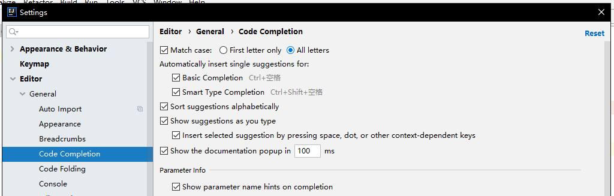

### 快捷键操作：

1. 弹出代码修改提示:`alt+enter`

2. 代码补全:`ctrl+space`

3. 输出快捷键:`sout`

4. get/set生成:`alt+insert`

### 基础设置

1.代码提示不区分大小写:File->settings->Editor->General->Code Completion下:

### 日常问题

1.当代码没有自动补全可查看File->Power Save mode自动省电是否开启