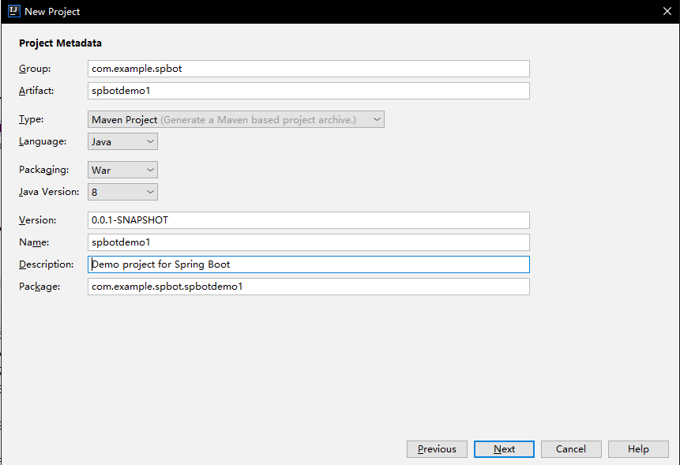
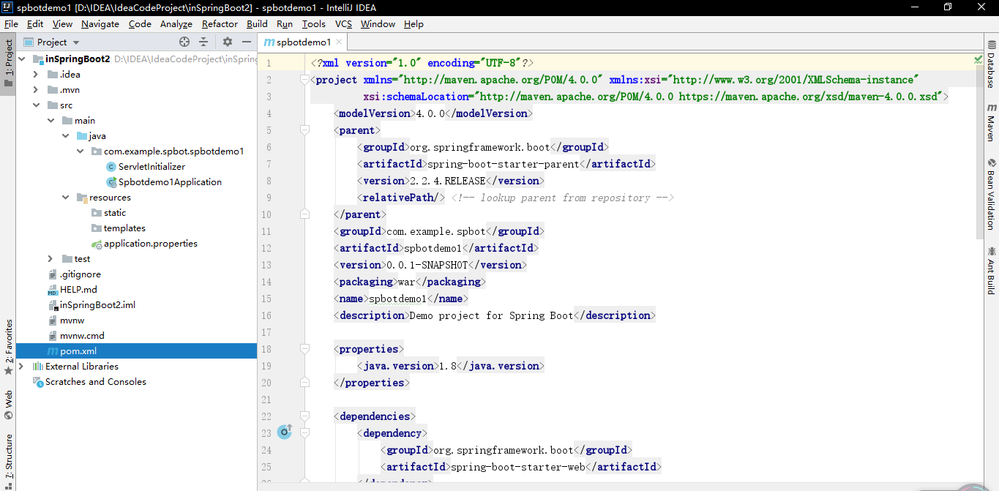
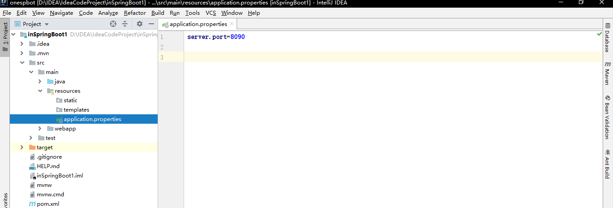
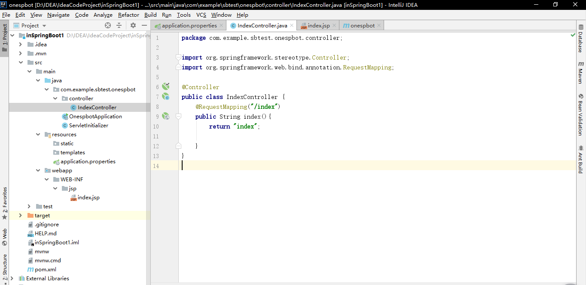
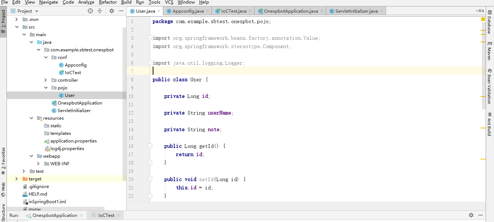
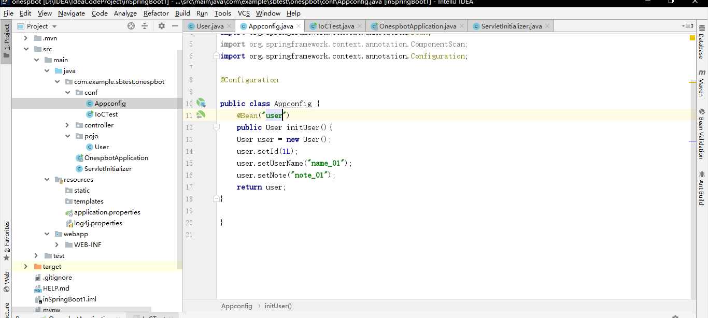
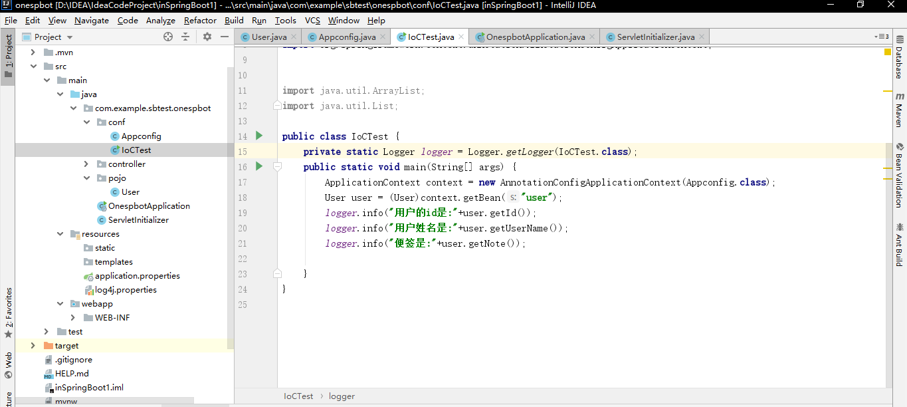
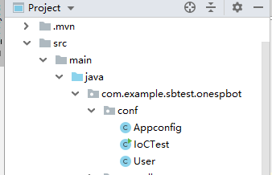
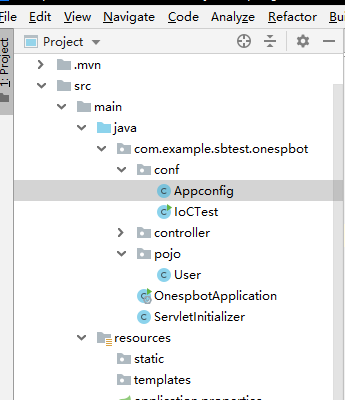

## 简单搭建Spring Boot开发环境 ##

### 搭建环境 ###

1. 启动Intellij IDEA，选择Create New Project，看到了一个新的窗口之后，选择Spring Initializr，将JDK切换为你想要的版本。

2. 点击Next，进行一定的配置



3. 点击Next，可以根据自己的需要选择对应的starter进行依赖。

4. 建好后，工程目录可以看到一个已经建好的类Spbotdemo1Application、ServletInitializer和Maven的pom.xml文件。运行Spbotdemo1Application就可以启动Spring Boot的工程，而pom.xml则配置好了你选中的starter依赖，这样就能够基于Intellij IDEA开发Spring Boot工程了。



5. 自定义配置:在新建的工程中可以看到一个属性文件application.properties文件，通过它可以根据自己的需要实现自定义。如图:



### 开发项目 ###

1. 新增JSP和JSTL的Maven依赖配置

```java
    <dependency>
	    <groupId>org.apache.tomcat.embed</groupId>
	    <artifactId>tomcat-embed-jasper</artifactId>
	    <version>9.0.24</version>
	    <scope>provided</scope>
	</dependency>
	<dependency>
	    <groupId>javax.servlet</groupId>
	    <artifactId>jstl</artifactId>
	    <scope>provided</scope>
	</dependency>
```

2. application.properties文件定义视图前后缀

```
server.port=8090
spring.mvc.view.prefix=/WEB-INF/jsp/
spring.mvc.view.suffix=.jsp
```

3. 开发控制器

```java
package com.example.sbtest.onespbot.controller;

import org.springframework.stereotype.Controller;
import org.springframework.web.bind.annotation.RequestMapping;

@Controller
public class IndexController {
    @RequestMapping("/index")
    public String index(){
        return "index";
    }
}
```

4. 开发视图

```html
<%--
  Created by IntelliJ IDEA.
  User: acer
  Date: 2020/1/28
  Time: 15:07
  To change this template use File | Settings | File Templates.
--%>
<%@ page contentType="text/html;charset=UTF-8" language="java" %>
<html>
<head>
    <title>jsp文件</title>
</head>
<body>
<h1>测试视图解析器</h1>
</body>
</html>

```

5. 运行application文件，打开浏览器访问`http://localhost:8090/index`



**注:Application启动类要放在最外侧，即包含所有的子包。因为Spring Boot会自动加载启动类所在包下及其子包下的所有组件**

## IoC容器 ##

定义：**在Spring中把每一个需要管理的对象成为Spring Bean(简称Bean)，而Spring管理这些Bean的容器，被我们成为Spring IoC容器(简称IoC容器)。**

> Spring IoC容器是一个管理Bean的容器，在Spring的定义中，所有的IoC容器都需要实现接口BeanFactory，它是顶级容器接口。而由于BeanFactory的功能还不够强大，因此Spring在BeanFactory的基础上，还设计了更为高级的接口ApplicationContext，它是BeanFactory的子接口之一，在现实中我们使用的大部分Spring IoC容器是ApplicationContext接口的实现类。

以下示例是基于注解的IoC容器AnnotationConfigApplicationContext。

* **第一个装配Bean的方法**

1. 定义User实体



2. 定义Java配置文件



> 注解`@Configuration`代表这是一个Java配置文件，Spring的容器会根据它来生成IoC容器去装配Bean；`@Bean`代表将initUser方法返回的pojo装配到IoC容器中，属性name表示这个Bean的名称，如果没有配置它，默认是方法名称"initUser".

3. 使用AnnotationConfigApplicationContext构建IoC容器。



* **通过扫描装配Bean**

> 如果Bean使用注解`@Bean`一个个注入到IoC容器中，将使一个非常麻烦的事情。Spring允许我们进行扫描装配Bean到IoC容器中。对于扫描装配而言使用的注解是`@Component`和`@ComponentScan`。`@Component`是表明哪个类被扫描进入Spring IoC容器，而`@ComponentScan`是标明采用何种策略去扫描装配Bean。

1. 首先移动User类到conf包下，这是因为注解了`@ComponentScan`的类默认扫描该类所在的当前包和其子包。



2. User类加入注解@Component

```java
package com.example.sbtest.onespbot.pojo;

import org.springframework.beans.factory.annotation.Value;
import org.springframework.stereotype.Component;

import java.util.logging.Logger;
@Component("user")
public class User {
    @Value("016")
    private Long id;
    @Value("LWX")
    private String userName;
    @Value("note1")
    private String note;

   //GET&SET...

}

```

> `@Component`表示这个类将被Spring IoC容器扫描装配，“user”是作为Bean的名称，不配置“user”的话默认会把类名的第一个字母作为小写，其他不变作为Bean名称放入到IoC容器中。`@Value`指具体的值。

3. AppConfig类加入注解`@ComponentScan`

```java
package com.example.sbtest.onespbot.conf;
import org.springframework.context.annotation.Bean;
import org.springframework.context.annotation.ComponentScan;
import org.springframework.context.annotation.Configuration;
@Configuration
@ComponentScan
public class Appconfig {

}

```

> 注解`@ComponentScan`表示它会进行扫描，且默认知会扫描类Appconfig所在的当前包以及子包。

4. 测试扫描

```java
package com.example.sbtest.onespbot.conf;


import com.example.sbtest.onespbot.pojo.User;
import org.apache.log4j.Logger;
import org.springframework.context.ApplicationContext;
import org.springframework.context.annotation.AnnotationConfigApplicationContext;

public class IoCTest {
    private static Logger logger = Logger.getLogger(IoCTest.class);
    public static void main(String[] args) {
        ApplicationContext context = new AnnotationConfigApplicationContext(Appconfig.class);
        User user = (User)context.getBean("user");
        logger.info("用户的id是:"+user.getId());
        logger.info("用户姓名是:"+user.getUserName());
        logger.info("便签是:"+user.getNote());
    }
}

```
可见，可以正常输出日志信息。

上述方法2为了能使User类能够被扫描而把它迁移到了其他的包中，这显然是不合理的，为了更加合理，`@ComponentScan`允许我们自定义扫描的包。

* **自定义扫描包**

可以通过配置项**basePackages**定义扫描的包名，其中还有**includeFilters**和**excludeFilters**。前者是定义满足过滤器条件的Bean才去扫描，后者则是排除过滤器条件的Bean

1. 重新把类User放到pojo包下。



2. 把Appconfig中的注解修改为:

(1)`@ComponentScan("com.example.sbtest.onespbot.pojo")`或`@ComponentScan("com.example.sbtest.onespbot.*")`

这样就可以扫描到pojo包下的类或者是onespbot下所有的包。注意，这里的地址不能直接写到类的位置。

(2) `@ComponentScan(basePackages={"com.example.sbtest.onespbot.pojo"})`

(3) `@ComponentScan(basePackageClasses = {User.class})`

> 当你扫描的包下面包含了标注了`@Service`(该标准注入了@Component，默认情况下会被Spring扫描装配到IoC容器中)的服务类而你又不想服务类被扫描装配的话，需要把扫描策略修改为:

`@ComponentScan(basePackages = "com.example.sbtest.onespbot.*",excludeFilters = {@Filter(classes = {UserService.class})})`。

这样，就可以把服务类UserService排除到SpringIoC容器之外了。事实上，之前的Spring Boot注解`@SpringBootApplication`也注入了`@ComponentScan`。所以如果标注了`@Component`的pojo类在标注了`@SpringBootApplication`的类所在的包或子包下，可以不用在类上标注`@ComponentScan`(OnespbotApplication是标注了@SpringBootApplication的启动类。):

```java
public static void main(String[] args) {
        ApplicationContext context = new AnnotationConfigApplicationContext(OnespbotApplication.class);
        User user = (User)context.getBean("user");
        logger.info("用户的id是:"+user.getId());
        logger.info("用户姓名是:"+user.getUserName());
        logger.info("便签是:"+user.getNote());

}

```

**可以被**`@ComponentScan`**扫描到的类的标注有:**

`@Controller`，`@Repository`，`@Service`或`@Component`


