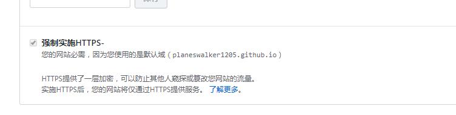

#### 环境:Windows 10 64bit

#### 工具:node.js     Git

#### 操作:

**1.安装Node.js**

打开官网:https://nodejs.org

**2.安装Git**

打开官网:https://git-scm.com/donloads

**3.管理员权限打开命令行**

**4.**`node -v`**查看node版本**

`npm -v`**npm包管理器版本**

**5.利用npm安装cnpm:**

`npm install -g cnpm --registry=https://registry.npm.taobao.org`

**6.查看cnpm版本**`cnpm`

**7.安装hexo:**`cnpm install -g hexo-cli`

验证:`hexo -v`

**8.创建一个文件夹**

创建blog文件夹，关于个人博客的操作都是在此文件夹中进行。

命令行到该文件夹下:`hexo init`，linux系统可使用命令`sudo hexo init`

**9.完成**

可访问本地`localhost:4000`访问个人博客页面。如果要部署可使用GitHub，deploy到远程库中

1. 在GitHub上创建仓库，注意仓库名称是要`用户名.github.io`

2. config.yml中添加相关属性。

repo:创建的GitHub仓库地址。

3. 命令:`hexo d(eploy)`

至于为什么仓库名称要是用户名:




<u>注:</u>

<u>在写博客文章的时候要记得在头部冒号后加上空格 ，再填写内容.</u>

**\#遇到的问题及解决方案:**

1.引入图片:

- 找到`Hexo`下的`_config.yml`文件里的post_asset_folder，修改诶`true`

- 在博客目录下打开`Git Bash Here`，执行一个下载上传图片插件的命令:`npm install hexo-asset-image --save`,也可以`cnpm install hexo-asset-image --save`

- 再次新建博客.md文件时，就会自动产生一个与博客同名的文件夹，这时候只需要把图片放入这个文件夹，在博客中引用图片的时候使用此文件夹的路径就可以了。

- 但有时候可能出现引用图片不成功的问题，那么这时候需要修改`/node_modules/hexo-asset-image/`下的indedx.js文件，打开并将其修改:


```javascript
	'use strict';
	var cheerio = require('cheerio');
    // http://stackoverflow.com/questions/14480345/how-to-get-the-nth-occurrence-       in-a-string
	function getPosition(str, m, i) {
    return str.split(m, i).join(m).length;
	}
	var version = String(hexo.version).split('.');
	hexo.extend.filter.register('after_post_render', function(data){
    var config = hexo.config;
    if(config.post_asset_folder){
    	var link = data.permalink;
	if(version.length > 0 && Number(version[0]) == 3)
	   var beginPos = getPosition(link, '/', 1) + 1;
	else
	   var beginPos = getPosition(link, '/', 3) + 1;
	// In hexo 3.1.1, the permalink of "about" page is like ".../about/index.html".
	var endPos = link.lastIndexOf('/') + 1;
    link = link.substring(beginPos, endPos);

    var toprocess = ['excerpt', 'more', 'content'];
    for(var i = 0; i < toprocess.length; i++){
      var key = toprocess[i];
      var $ = cheerio.load(data[key], {
        ignoreWhitespace: false,
        xmlMode: false,
        lowerCaseTags: false,
        decodeEntities: false
      });
      $('img').each(function(){
		if ($(this).attr('src')){
			// For windows style path, we replace '\' to '/'.
			var src = $(this).attr('src').replace('\\', '/');
			if(!/http[s]*.*|\/\/.*/.test(src) &&
			   !/^\s*\//.test(src)) {
			  // For "about" page, the first part of "src" can't be removed.
			  // In addition, to support multi-level local directory.
			  var linkArray = link.split('/').filter(function(elem){
				return elem != '';
			  });
			  var srcArray = src.split('/').filter(function(elem){
				return elem != '' && elem != '.';
			  });
			  if(srcArray.length > 1)
				srcArray.shift();
			  src = srcArray.join('/');
			  $(this).attr('src', config.root + link + src);
			  console.info&&console.info("update link as:-->"+config.root + link + src);
			}
		}else{
			console.info&&console.info("no src attr, skipped...");
			console.info&&console.info($(this));
		}
      });
      data[key] = $.html();
    }
    }
	});
```

参考地址:[https://blog.csdn.net/xjm850552586/article/details/84101345](https://blog.csdn.net/xjm850552586/article/details/84101345)

### \#MarkdownPad设置及操作

1. 代码块: 
  
 - 可使用 `<pre\> </pre\>`标签实现代码块,不过这里要在Tools->options->Markdown->Markdown Processor-->设置为Markdown

 - 使用格式为\``` 内容  \```，但如果想实现代码之间的换行同样要设置:Tools->options->Markdown->Markdown Processor-->设置为CommonMark


	
