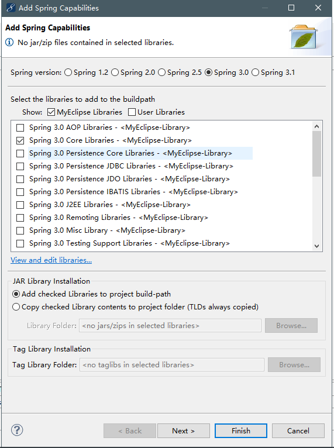
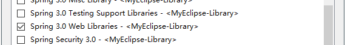
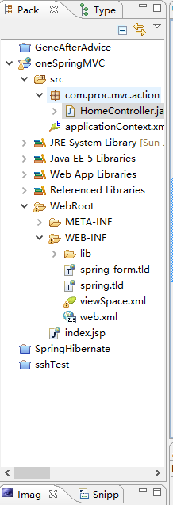

# C7 SpringMVC框架基础

### 介绍

相比Struts2，SpringMVC控制器的设计有着更加突出的特点。

1. 使用@RequestParam能够更加方便地获取HttpServletRequest中的参数值。
2. 结合@RequestMapping注解能够非常灵活地实现对Result URL的支持
3. 对于Ajax的支持，@RequestBody提供了方便的机制
4. 拥有灵活丰富的@Controller的函数返回类型

工作原理:

1.  当用户在浏览器中点击链接或提交表单时，就会产生一个请求。
2. 请求到达前端控制器DispatcherServlet，它决定将请求传给哪一个控制器（Controller）处理，此时便需要使用处理器映射(Handler Mapping)。
3. 在控制器上，处理用户的提交参数控制器并等待，控制器将调用业务逻辑(Model)。
4. 当调用的业务逻辑处理完毕后，将结果封装在ModelAndView对象中返回给DispatcherServlet。
5. DispatcherServlet会向一个视图解析器(ViewResolver)进行请求，视图解析器可以将逻辑视图名称映射到一个特定的视图显示文件上。
6. 最后DispatcherServlet将一个视图文件响应给客户端。

---

### 配置Spring MVC的工程架构

首先，在工程中添加Spring支持；然后，在web.xml配置中，添加SpringMVC相关配置；最后，在WEB-INF目录下，创建Spring MVC配置文件，详细代码如下:

1. 创建Web工程，添加Spring对Core Libraries和Web Libraries的支持。

   



2. 在web.xml文件中初始化加载Spring配置文件和Web监听器。

   ```
     <context-param>
     <param-name>contextConfigLocation</param-name>
     <param-value>classpath:applicationContext.xml</param-value>
     </context-param>
     <listener>
     <listener-class>org.springframework.web.context.ContextLoaderListener</listener-class>
     </listener>
   ```

3. 在web.xml文件中添加Servlet配置参数，声明DispatcherServlet，该控制器拦截"*.form"的请求:

   ```
     <servlet>
     <servlet-name>viewSpace</servlet-name>
     <servlet-class>
     org.springframework.web.servlet.DispatcherServlet
     </servlet-class>
     <load-on-startup>1</load-on-startup>
     </servlet>
     <servlet-mapping>
     <servlet-name>viewSpace</servlet-name>
     <url-pattern>*.form</url-pattern>
     </servlet-mapping>
   ```

   在配置中，servlet-name命名为"viewSpace"。服务器启动时，会在WEB-INF目录中自动加载一个名为“viewSpace-servlet.xml”的配置文件，该文件时SpringMVC的专属配置文件，它与模型层的配置文件分离。客户端请求通过*.form拦截，进入SpringMVC生命周期。url-pattern的拦截规则可以自定义，或者定义为"/"

4. 在WEB-INF目录中创建viewSpace-servlet.xml文件，定义注解的自动装载范围。

   ```
   <?xml version="1.0" encoding="UTF-8"?>
   <beans xmlns="http://www.springframework.org/schema/beans"
   xmlns:xsi="http://www.w3.org/2001/XMLSchema-instance"
   xmlns:p="http://www.springframework.org/schema/p"
   xmlns:context="http://www.springframework.org/schema/context"
   xsi:schemaLocation="http://www.springframework.org/schema/beans
   	http://www.springframework.org/schema/beans/spring-beans-3.0.xsd
   	http://www.springframewrok.org/schema/context
   	http://www.springframework.org/schema/context/spring-context-3.0.xsd">
   	<context:component-scan base-package="com.proc.mvc.action"/>
   </beans>
   ```

   在配置中，首先，beans元素添加context命名空间；然后，假如context:component-scan元素，它会自动扫描base-package指向的包的位置，只要在Java代码中发现@Controller注解的类，都会自动转换成控制器类，处理客户端请求。

5. 在Action包中创建HomerController控制器类来处理表单的“test.form”请求

   ```
   package com.proc.mvc.action;
   
   import org.springframework.stereotype.Controller;
   import org.springframework.web.bind.annotation.RequestMapping;
   //使用@Controller，将HomeController变成一个Handler控制器
   @Controller
   //指定控制器映射的URL
   @RequestMapping("/")
   public class HomeController {
   	//处理方法对用的URL，相对于/test.form处的URL
   	@RequestMapping(value = "/test")
   	public String test(){
   		System.out.println("HelloController test()....");
   		return "home.html";
   	}
   }
   ```

   @Controller注解将HomeController类自动转换成控制器类；@RequestMapping是用于处理请求地址映射的注解，可用于类或方法上。用于类上，表示类中所有响应请求的方法都是以该地址作为父路径；用于方法上，表示最终的路径名。在本例中，test方法通过@RequestMapping注解转化为控制器方法，客户端通过“test.form”地址发送请求。方法通过返回的实际页面文件名，转向WebRoot下的home.html页面。类编写完后，工程架构如下:

   

   6. 在WebRoot目录中创建index.jsp文件，测试请求:

      ```html
      <body>
      	<a href = "test.form">请求</a>
      </body>
      ```

   7. 在WebRoot目录中创建home.html文件

      ```
      <body>
      	<h1>hello.html</h1>
      </body>
      ```

   8. 点击“请求”超链接，成功跳转到home.html页面并在控制台上打印输出。

**可能会出现的错误:**

no declaration can be found for element ‘context:component-scan’ :[https://blog.csdn.net/smile326/article/details/51803024]

注:在控制器方法返回值中，"redirect:/地址"表示页面重定向。否则是转向。

```
//处理转向
@RequestMapping(value = "/fwd")
public String forward(){
    return "fwd.html";
}
//处理重定向
@RequestMapping(value = "/rdt")
public String redirect(){
    return "redirect:/rdt.html";
}
```

---

### 注解驱动的控制器

@RequestMapping注解和属性

Spring 3.0 MVC注解功能，其中，@RequestMapping，@PathVariable，@RequestParam和@ModelAttribute都是常用的注解。

1. @RequestMapping用于处理请求地址映射的注解，可用于类或者方法上。

2. @PathVariable用于对指定请求的URL路径中的变量接收动态传参。

3. @RequestParam用于接收基本数据类型参数。

4. @ModelAttribute用于接收模型数据。

   ​								**@RequestMapping注解的属性参数**

   |  属性名  |                             说明                             |
   | :------: | :----------------------------------------------------------: |
   |  value   | 指定请求的实际地址，指定的地址可以是URL Template模式；常用属性 |
   |  method  |        指定请求的Method类型，GET,POST,PUT和DELETE等。        |
   | consumes |   指定处理请求的提交内容类型，如application/JSON，ext/html   |
   | produces | 指定返回的内容类型，仅当request请求头中的Accept类型中包含该指定类型时才返回 |
   |  params  |      指定Request中必须包含某些参数值，才使用该方法处理       |
   | headers  | 指定Request中必须包含某些指定的header值，才能使用该方法处理请求 |

**使用@RequestParam接收简单参数。**

该方式类似于request.getParameter的取参方式，区别在于@RequestParam采用入参方式，在方法中直接使用请求参数，如下:

Action包中创建MethodController类:

```
@Controller
@RequestMapping("/method")

```

**使用@PathVariable接收路径中的参数**

@PathVariable是用于对指定请求的URL路径中的参数，接收动态传参，如下:

```33333
<a href = "method/jack/items.form">测试</a>
<a href = "method/items3.form">测试</a>
```

要在超链接中获取“jack”或者“3”，如下代码:

1. 在MethodController类中添加处理方法

```
//接收请求中的参数
@RequestMapping(value="/{owner}/items")
public String inPathVariable1(@PathVariable String owner){
    System.out.println("得到@PathVariable参数:"+owner);
    return "home.html";
}
//接收请求中的参数
@RequestMapping(value="/items{pageNo}")
public String inPathVariable2(@PathVariable String pageNo){
    System.out.println("得到当前页码:"+pageNo);
    return "home.html";
}
```

**注：如果要在类级别上添加的@RequestMapping()方法中参数是@RequestMapping("/method"),那么在页面上访问的路径是**`<a href = "method/***.form"></a>`**,且方法中返回的地址要是重定向的：如:**

`return "redirect:/home.html"`，**或者使用绝对定位，在地址前面加上“/”:** `return "/home.html" `   **否则默认返回的地址是类别是转发，而默认转发的路径是**`method/home.html`**，显而易见的，资源文件中并没有method的这个路径。接收路径中的参数也是同理。**

---

### 处理模型数据

当提交属性非常多时，入参属性也会增多，这样不便于维护，我们可以使用@ModelAttribute来解决参数封装的问题。

在SpringMVC中提供了@ModelAttribute注解，实现了对入参数据的封装。在使用时，需要注意的是页面提交的参数名要与模型属性一一对应：

1. 在Entity包中创建UsersEntity类，用于封装用户请求参数

   ```
   public class UserEntity{
       private String userName;
       private String userPass;
       private String userTel;
       private String userJob;
       //get、set方法
      ...
   }
   ```

2. 在util包中定义MD5加密类。

   ```
   public class MD5{
       public static String getInstance(String plainText)
       throws NoSuchAlgorithmException{
           //生成一个MD5加密计算摘要
           MessageDigest md = MessageDigest.getInstance("MD5");
           //计算MD5函数
           md.update(plaintText.getBytes());
           //将8位的字符串转换为16位数的hex值
           return new BigInteger(1.md.digest()).toString(16);
       }
   }
   ```

3. 在Action包中创建RegController类，用于处理用户请求。

   ```
   @Controller
   @RequestMapping("/users")
   public class RegController{
       @RequestMapping(value = "/reg")
       public String reg(@ModelAttribute("user") UsersEntity us)throws Exception{
           //使用MD5对密码进行加密
           String newUserPass = MD5.getInstance(us.getUserPass);
           //将密码回存
           us.setIserPath(newUserPass);
           //由于追加了users路径，因此使用“/”定位绝对定位
           return "/success.jsp";
       }
   }
   ```

   @ModelAttribute("user")：表示将UsersEntity对象保存到HttpServletRequest中，在页面上以EL表达式

   ${user.userName}进行获取

   UserEntity:表示将请求消息绑定到该对象中。

   us:表示参数名

4. WebRoot目录中，创建jsp页面，设计注册页面的表单。

   ```
   <input type= "text" name = "userName"/>
   <input type= "password" name = "userPass"/>
   <input type= "text" name = "userTel"/>
   <input type= "text" name = "userJob"/>
   ```

   