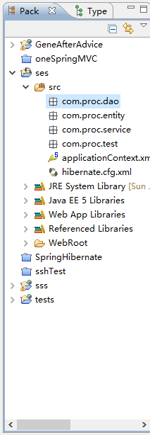

# Chapter3 Spring整合Hibernate框架

### SH框架的优势

 Spring支持JDBC，Hibernate，JPA和MyBatis等数据库持久层框架的整合，并在整合基础上加入了封装类和声明式事务，以简化编程，Hibernate处于Spring的管理之下，SessionFactory由Spring接管，通过IoC注入式管理。其具体优势如下:

1. IoC容器提高了DAO组件与业务逻辑组件之间的解耦。
2. 通用的资源管理。Spring的ApplicationContext能够管理SessionFactory对象，在架构搭建时无须自定义公共管理类。
3. 公共DAO方法的封装，Spring提供了HibernateTemplate对象，封装了数据库操作的大多数方法，有效地提高了开发效率。
4. 有效地Session管理。Spring提供了有效，简单和安全的Hibernate Session处理。
5. 方便的事务管理。Spring采用AOP方式管理事务，在简化编码的同时，也提高了代码的可维护性。

### 使用IDE环境搭建SH框架

1. 创建Web工程，在工程中添加Spring框架支持。选择Spring对Core Libraries，AOP Libraries和Persistence Core方面的支持。

   

2. 在工程中添加Hibernate框架支持，选择Advanced Support libraries扩展支持。

   

3. 选择Hibernate的配置文件独立创建方式。

   

4. 选择新创建的Hibernate配置文件，将Hibernate托管给Spring

   

   此时，hibernate.cfg.xml文件将生成在src目录中，独立配置Hibernate参数。并且，在applicationContext.xml文件中添加对该文件的引用。这意味着Spring接管Hibernate，封装SessionFactory对象。

5. 配置Hibernate连接数据库驱动和方言。

   

6. 取消创建BaseSessionFactory类，整合后，无须再基于该类编程。

   

7. 在src目录下创建各包分层管理源代码。

   

8. 修改applicationContext.xml文件，添加Spring对Hibernate注解的支持。如果采用Hibernate注解方式，则需要添加配置信息。

   ```java
   <bean id="sessionFactory"
   		class="org.springframework.orm.hibernate3.LocalSessionFactoryBean">
   		<property name="configLocation"
   			value="classpath:hibernate.cfg.xml">
   		</property>
   	</bean>
   ```

   修改为

   ```java
   <bean id="sessionFactory"
   		class="org.springframework.orm.hibernate3.annotation.AnnotationSessionFactoryBean">
   		<property name="configLocation"
   			value="classpath:hibernate.cfg.xml">
   		</property>
   		<property name = "configurationClass" value = 	
   		"org.hibernate.cfg.AnnotationConfiguration"/>	
   	</bean>
   ```

9. 修改hibernate.cfg.xml文件，在connection.url属性中启动hibernate自动提交事务模式

   ```
   <property name = "connection.autocommit">true</property>
   ```

10. 数据库创建表，使用MyEclipse Database Explorer反向工具生成表。

  

11. 生成后如图

    

12. 把Employee和GangWei类文件拖拽进entity包中，并修改hibernate.cfg.xml和DAO方法中类文件的位置信息。