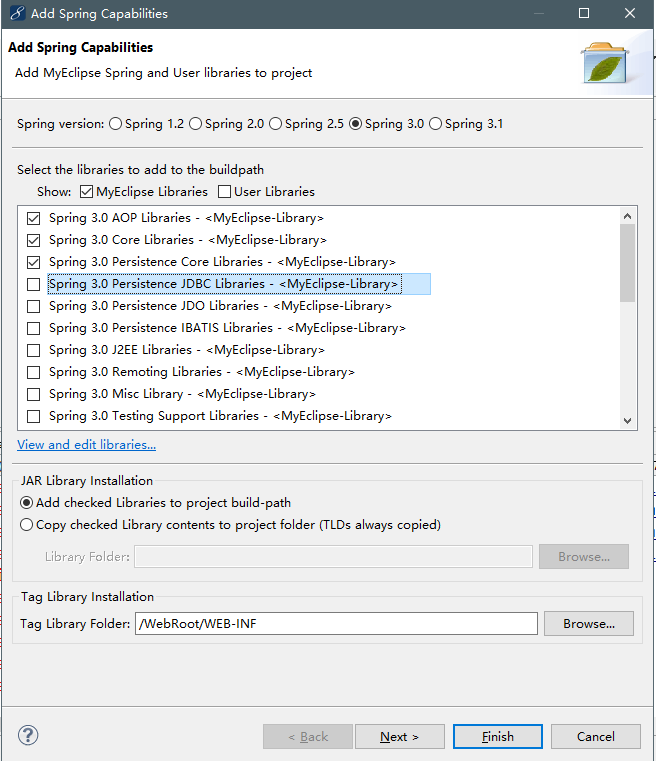
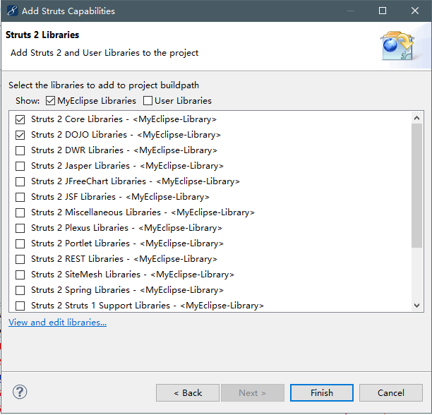
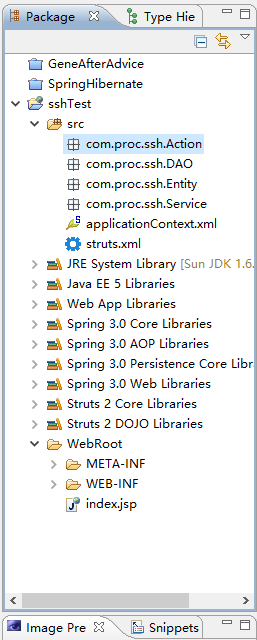

# Chapter5 Spring框架整合实现SSH架构搭建

---

#### 整合Struts2框架

**1. 为了实现控制层与业务逻辑层的分离，可将SSH层次结构进行如下细分:**

(1)：PO层，即持久化对象，通过实体关系映射工具将关系型数据库的数据映射为对象，便捷地实现了以面向对象方式来操作数据库。系统通常采用Hibernate作为ORM框架。

(2)DAO层，负责与持久化对象交互，封装了数据的增删改查等操作。

(3)Service层，业务逻辑层，负责实现业务逻辑，以DAO层为基础，通过对DAO组件的封装实现系统所需的业务逻辑。

(4)WEB层，负责控制业务逻辑层与表现层的交互，调用业务逻辑层，并将业务数据返回表现层作为组织表现，系统的MVC框架一般采用Struts。

**2. 使用Spring整合Struts框架**

描述Spring整合Struts2的搭建过程，首先，添加Spring支持；然后，添加Struts2支持；最后，修改web.xml文件配置，设置服务器启动时创建Spring容器。

(1)创建Web工程，添加Spring支持，选择Spring对Core Libraries,AOP Libraries,Persistence Core和Web Libraries的支持。添加Spring的后续步骤与之前一样。




(2)在工程中添加Struts2的支持,，随后创建Action，DAO，Entity以及Service包（添加struts2-spring-plugin-2.2.1的jar包）。选择Struts2 Core Libraries。DOJO包可选可不选。





(3)在web.xml文件中添加启动参数

```
<context-param>
	<param-name>contextConfigLocation</param-name>
	<param-value>classpath:applicationContext.xml</param-value>
</context-param>
```

当服务器装载项目时，通过预定义contextConfigLocation属性接收到参数，Spring将读取applicationContext.xml配置文件，实例化Spring BeanFactory、

(4)在web.xml文件中添加启动配置

```
<listener>
	<listener-class>
	org.springframework.web.context.ContextLoaderListener
	</listener-class>
</listener>
```

**整合Hibernate框架并完成业务逻辑代码**

Hibernate框架的配置与前面章节相同。注意:在applicationContext.xml文件中注入过的对象，那么只能使用getbean()来获取对象。

---

### 基于SSH框架完成简单分页

实现方案:

 该案例使用SSH架构实现数据分页功能。首先，了解页面导航图；其次，在DAO层使用executeFind方法封装分页底层实现；然后，在业务逻辑层进行业务逻辑封装，返回当前页的数据；最后，结合视图层显示分页数据和功能按钮。

1. 在CustomerDAO类中实现分页的底层代码。

   ```java
   public List<Customer> getPages(final int page,final int rows){
       List listTable = getHibernateTemplate().executeFind(
       new HibernateCallback(){
           public Object doInHibernate(Session session){
               Criteria cri = session.createCriteria("com.proc.ssh.Entity.Customer");
               cri.setFirstResult(page);
               cri.setMaxResults(rows);
           }
       });
       return listTable;
   }
   ```

   上述代码中，executeFind方法通常在查询时会用到，参数是HibernateCallback对象，其方法返回List类型。在HibernateCallback对象中，doInHibernate方法专门采用Hibernate API进行编码，是一种原生的Hibernate解决方案。

2. 在CustomerService类中封装分页的底层实现。

   ```
   public List<Customer> getCustomerPage(int page,final int rows){
       //将传入的页面减1，改变游标位置
       return this.getCustomerDAO().getPages((page-1)*rows,rows);
   }
   ```

3. 在CustomerAction文件中添加处理请求的方法。

   ```
   //接收页码参数
   private int page;
   //定义每页显示的行数
   private int rows = 5;
   //get/set方法
   public String display() throws Exception{
       ActionContext.getContext().put("cusList",this.getCustomerService().getCustomerPage(page,rows));
       return "display";
   }
   ```

4. 在Struts.xml文件中添加导航配置。

5. 在jsp页面添加链接，进入分页列表第一页。

6. 定义jsp页面显示分页列表。

---


问题:

1. 

## [对于java.lang.NoSuchMethodError: antlr.collections.AST.getLine()I错误解决](https://www.cnblogs.com/songhaipeng/p/3323541.html)

在J2EE框架下开发web网站，这种问题经常遇到，只要我们网上搜一下，就可以看到很多版本的，我整理一下： 
第一种可能性解决：看看我的项目：主要 是里面的Structs 1.3 （structs 2）和Hibernate 3.2（或更高版本）中的JAR包里antlr2.7.2 与 antlr2.7.6 冲突，只要删除Structs 1.3中的低版本的antlr2.7.2就可以了。具体操作如下：在MyEclipse 下，windows-->preferences-->在文本框中搜索struts2-->选择 antlr2.7.2-->remove
第二种可能性解决：主要是里面的Structs 1.3和tomact中的 antlr2.7.2 与 antlr2.7.6 冲突 删除antlr2.7.2 即可，具体方法：在MyEclipse下，windows-->preferences-->在文本框中搜索struts2-->选择 antlr2.7.2-->remove在tomcat该应用的目录WEB-INF\lib 删除 antlr2.7.2.jar  目前貌似就这么两种解决方法吧

1. 

当finall块中包含return语句时，Eclipse会给出警告“finally block does not complete normally”，原因分析如下：

(1)、不管try块、catch块中是否有return语句，finally块都会执行。
(2)、finally块中的return语句会覆盖前面的return语句（try块、catch块中的return语句），所以如果finally块中有return语句，Eclipse编译器会报警告“finally block does not complete normally”。

(3)、如果finally块中包含了return语句，即使前面的catch块重新抛出了异常，则调用该方法的语句也不会获得catch块重新抛出的异常，而是会得到finally块的返回值，并且不会捕获异常。
 ———————————————— 
版权声明：本文为CSDN博主「chh_jiang」的原创文章，遵循CC 4.0 by-sa版权协议，转载请附上原文出处链接及本声明。
原文链接：https://blog.csdn.net/chh_jiang/article/details/4557461

2. 当注入继承了hibernatedaosupport的dao包时，要在bean中写sessionfactory属性

   ```
   <bean id="argManagebean" class="com.proc.manage.dao.argManageDao">
   	<property name="sessionFactory">
   			<ref bean="sessionFactory" />
   		</property>
   	</bean>
   ```

3. 项目出错可能会是jar包冲突问题，删除冲突jar包后记得清理tomcat，重新部署项目。

4. 关于懒加载

   由于懒加载本身的机制，一个类中相关联的属性类不能直接通过类获取。

   而是要在dao包里查询时顺便查询多的属性。或者lazy=false

   ```
   public List<TbBonus> getbonusReco(String hql){
   		List<TbBonus> newbonusList = new ArrayList<TbBonus>();
   		List<TbBonus> reList = this.getHibernateTemplate().find(hql);
   		ApplicationContext context = new 
   		ClassPathXmlApplicationContext("applicationContext.xml");
   		hibernateDao service = (hibernateDao) context.getBean("hiberdaobean");
   		for (TbBonus tbBonus : reList) {
   			Set<TbBonusRecord> sets = tbBonus.getTbBonusRecords();
   			for (TbBonusRecord tbBonusRecord : sets) {
   				String hqls = "from TbBonusRecord t where 
   				t.bonusrecordId="+tbBonusRecord.getBonusrecordId();
   				try {
   					service.findByHql(hqls);
   				} catch (Exception e) {
   					// TODO Auto-generated catch block
   					e.printStackTrace();
   				}
   			}
   			
   		}
   		return reList;
   	}
   ```

5. ## java.sql.SQLException: ResultSet may only be accessed in a forward direction.

   自身原因：service包中，（(page-1*rows)少写了一个括号。((page-1)\*rows)

6. 使用ssh框架结合easyui查询datagrid数据时，不能直接返回List集合，而要包含rows，page数据。也就是Map类型数据。map.put("rows",n),map.put("total",e)诸如此类。

7. 当隐藏div时(display=none)，再在js里把div渲染成dialog，要在此之前使用show()方法，避免此div没有高度的问题。

8. 当a标签中传入js方法`<a href="javascript:onedef()">方法</a>`时，方法中的参数有String类型，传入的方法会报错，诸如:Onclick Syntaxerror: identifier starts immediately after numeric literal或者Uncaught ReferenceError: 优秀员工奖 is not defined此类的错误。解决方法是加入转义符号 ' \ '  如:

   ```
   <a href='javascript:editBonusDia(\"" + row.bonusName + "\")'>编辑</a>
   ```

9. input中有属性 disabled="disabled"时，值可能无法传到action页面。

10. merge的作用是：新new一个对象，如果该对象设置了ID，则这个对象就当作游离态处理：

            当ID在数据库中不能找到时，用update的话肯定会报异常，然而用merge的话，就会insert。
              
            当ID在数据库中能找到的时候，update与merge的执行效果都是更新数据，发出update语句
          ————————————————
          版权声明：本文为CSDN博主「浪漫星空」的原创文章，遵循 CC 4.0 BY-SA 版权协议，转载请附上原文出处链接及本声明。
          原文链接：https://blog.csdn.net/lang_man_xing/article/details/7572964

11. easyui中combobox中设置默认值问题

       `$("#com").combobox('setText',"默认文本值")` 此种方法并不能直接赋给combobox渲染的input的值。由于渲染的combobox有两个属性来决定渲染的“值“和显示的”文本“，所以combobox正确设置值得方式除了select属性外还可以直接
      
       ```
        $('#test').combobox({
       			textField : 'text',
       			valueField : 'value',
       			panelHeight : 'auto',
       			data : data,
       			onLoadSuccess : function(){
       			    $('#test').combobox('setValue','6');
       			}
       		})
       ————————————————
       版权声明：本文为CSDN博主「themeth」的原创文章，遵循 CC 4.0 BY-SA 版权协议，转载请附上原文出处链接及本声明。
       原文链接：https://blog.csdn.net/themeth/article/details/80593882
       ```
      
       也就是直接在onLoadSuccess方法中设置默认的valueField的值，那么显示在文本的值可以根据对应于valueField值获取textField

12. 关于懒加载的问题只有在方法里处理查询操作时才需要处理懒加载相关问题，其他的一般不用处理