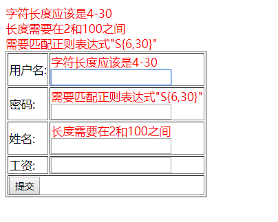

# Chapter8 SpringMVC数据校验与视图标签

Spring的org.springframework.validation是校验框架所在的包

---

### 使用数据校验完成用户注册

​	用户在注册页面提交表单，经过控制器接收处理。如果验证失败则返回注册页面，验证通过则进入其他页面。在程序实现时，首先，导入数据校验时所需要的Jar包文件；其次，在Spring配置中使用\<mvc:annotation-driven\>启动验证框架；然后，在数据模型中添加数据校验注解，最后，在错误回执页面中使用\<form:errors\>标签输出消息提示。如下代码:

1. 首先，创建Web工程并命名，然后添加Spring对Core Libraries和Web Libraries的支持。最后，在web.xml文件中配置初始化加载项。

2. 在lib目录下，导入(复制)数据校验所需要的Jar包文件。

   * validation-api-1.0.0.GA.jar:JSR 303官方驱动
   * hibernate-validator-4.3.0.Final.jar:Hibernate对JSR 303的封装包
   * jboss-logging-3.1.0.CR2.jar:辅助日志包

3. 在WEB-INF目录中创建viewSpace-servlet.xml文件并编码。

   ```
   <?xml version="1.0" encoding="UTF-8"?>
   <beans xmlns="http://www.springframework.org/schema/beans"
   xmlns:xsi="http://www.w3.org/2001/XMLSchema-instance"
   xmlns:p="http://www.springframework.org/schema/p"
   xmlns:mvc="http://www.springframework.org/schema/mvc"
   xmlns:context="http://www.springframework.org/schema/context"
   xsi:schemaLocation="http://www.springframework.org/schema/beans
   	http://www.springframework.org/schema/beans/spring-beans-3.0.xsd
   	http://www.springframework.org/schema/context
   	http://www.springframework.org/schema/context/spring-context-3.0.xsd
   	http://www.springframework.org/schema/mvc
   	http://www.springframework.org/schema/mvc/spring-mvc-3.0.xsd">
   	//自动注册SpringMVC所需的所有驱动
   	<mvc:annotation-driven/>
   	<context:component-scan base-package="com.proc.mvc.action"/>
   	//注入数据校验类
   	<bean id = "validator" class = "org.springframework.
   	validation.beanvalidation.LocalValidatorFactoryBean">
   </bean>
   </beans>
   ```

   在配置中，beans元素添加context和mvc命名空间支持；再使用\<mvc:annotation-driven\>注册所有SpringMVC所需的驱动器，包括数据校验框架。

4. 在Entity包中创建实体类，采用JSR303标准实现数据校验。

   ```java
   package com.proc.Entity;
   
   import javax.validation.constraints.DecimalMax;
   import javax.validation.constraints.DecimalMin;
   import javax.validation.constraints.Pattern;
   
   import org.hibernate.validator.constraints.Length;
   import org.springframework.format.annotation.NumberFormat;
   
   public class UsersEntity {
   	private String userId;
   	@Length(min=0)
   	@Pattern(regexp="w{4,30}",message="字符长度应该是4-30")
   	private String userName;
   	@Pattern(regexp="S{6,30}")
   	private String password;
   	@Length(min=2,max=100)
   	private String realName;
   	@DecimalMin(value="1000.00")
   	@DecimalMax(value="100000.00")
   	@NumberFormat(pattern="#,###.##")
   	private Long salary;
   	public UsersEntity() {
   		super();
   	}
   	public UsersEntity(String userId, String userName, String password,
   			String realName, Long salary) {
   		super();
   		this.userId = userId;
   		this.userName = userName;
   		this.password = password;
   		this.realName = realName;
   		this.salary = salary;
   	}
   	public UsersEntity(String userName, String password, String realName,
   			Long salary) {
   		super();
   		this.userName = userName;
   		this.password = password;
   		this.realName = realName;
   		this.salary = salary;
   	}
   	//get/set方法
   	@Override
   	public String toString() {
   		return "UsersEntity [userId=" + userId + ", userName=" + userName
   				+ ", password=" + password + ", realName=" + realName
   				+ ", salary=" + salary + "]";
   	}
   	
   }
   ```

   * @Length:被注释的字符串的大小必须在指定范围内。
   * @Pattern(regexp,message):被注释的元素必须匹配指定的正则表达式。参数regexp表示正则表达式的含义，其中`w{4,30}`表示仅能输入4到30位长度的由数字，字母或下划线组成的字符串；`S{6,30}`表示匹配任何6到30位长度的非空白字符；参数message表示输出到视图的提示消息。
   * @DecimalMin(value):表示被注释的元素必须是一个数字，其值必须不小于指定的值。
   * @DecimalMax(value):表示被注释的元素必须是一个数字，其值必须不大于指定的值。
   * @NumberFormat(pattern):表示被注解的元素允许数字格式化，例如"#,###.##"允许输入为1,000.00。

5. 创建UsersController类，接收页面请求，处理数据校验。

   ```java
   package com.proc.mvc.action;
   
   import javax.validation.Valid;
   
   import org.springframework.stereotype.Controller;
   import org.springframework.validation.BindingResult;
   import org.springframework.web.bind.annotation.ModelAttribute;
   import org.springframework.web.bind.annotation.RequestMapping;
   
   import com.proc.Entity.UsersEntity;
   
   @Controller
   @RequestMapping("/")
   public class UsersController {
   	@RequestMapping(value="/vald")
   	public String vald(@Valid @ModelAttribute("user") UsersEntity user,BindingResult bindresult){
   		if(bindresult.hasErrors()){
   			return "index.jsp";
   		}
   		return "main.html";
   	}
   }
   
   ```

   上述代码中，@Valid注解表示执行UsersEntity类中的数据验证，BindingResult参数用于收集错误消息，当有错误消息时，hasErrors方法为true，将视图返回到原页面。

6. 创建index.jsp文件。使用\<form:errors\>标签输出提示消息，

   ```
   <%@ page language="java" import="java.util.*" pageEncoding="utf-8"%>
   <%@taglib uri="http://www.springframework.org/tags/form" prefix="form" %>
   <%
   String path = request.getContextPath();
   String basePath = request.getScheme()+"://"+request.getServerName()+":"+request.getServerPort()+path+"/";
   %>
   
   <!DOCTYPE HTML PUBLIC "-//W3C//DTD HTML 4.01 Transitional//EN">
   <html>
     <head>
       <base href="<%=basePath%>">
       
       <title>My JSP 'index.jsp' starting page</title>
   	<meta http-equiv="pragma" content="no-cache">
   	<meta http-equiv="cache-control" content="no-cache">
   	<meta http-equiv="expires" content="0">    
   	<meta http-equiv="keywords" content="keyword1,keyword2,keyword3">
   	<meta http-equiv="description" content="This is my page">
   	<!--
   	<link rel="stylesheet" type="text/css" href="styles.css">
   	-->
   	<style type="text/css">
   	.errorClass{
   	color:red;
   	}
   	</style>
     </head>
     
     <body>
    
       <form:form modelAttribute="user" action = "vald.form">
       <form:errors path="*" cssClass="errorClass" element="div"/>
       <table border="1">
       <tr>
       <td>用户名:</td>
       <td>
       <form:errors path="userName" cssClass="errorClass" element="div"/>
       <input type = "text" name = "userName"/>
       </td>
       </tr>
       
        <tr>
       <td>密码:</td>
       <td>
       <form:errors path="password" cssClass="errorClass" element="div"/>
       <input type = "password" name = "password"/>
       </td>
       </tr>
       
        <tr>
       <td>姓名:</td>
       <td>
       <form:errors path="realName" cssClass="errorClass" element="div"/>
       <input type = "text" name = "realName"/>
       </td>
       </tr>
       
        <tr>
       <td>工资:</td>
       <td>
       <form:errors path="salary" cssClass="errorClass" element="div"/>
       <input type = "text" name = "salary"/>
       </td>
       </tr>
       
       <tr>
       <td colspan="2"><input type = "submit" value = "提交"/></td>
       </tr>
       </table>
       </form:form>
     </body>
   </html>
   
   ```

   在上述代码中:结合Spring\<form:errors\>标签输出错误消息。modelAttribute=“user”属性与任何form标签的path都相匹配，如果path指向的属性不能与modelAttribute所指定的对象属性相匹配，则页面会报错。

   在errors标签中，path表示输出的错误属性名(键)，当其为"*"时，表示输出所有；cssClass表示调用CSS类选择器；element表示输出样式；“div”表示将内容置于div块内。

7. 在注册表单不填写任何信息，点击提交按钮，查看浏览器显示结果。

   

---

### 控制层传参

在SpringMVC中，提供了丰富的作用域传值方式，既可以用ModelAndView对象，也可以使用ServletAPI，如HttpServletRequest和HttpSession。

**ModelAndView对象**

Spring控制器处理方法的返回值通常使用ModelAndView对象，它来自于org.springframework.web.servlet包下的定义。ModelAndView既包含了视图信息，又包含了模型数据信息，SpringMVC既可以使用视图对模型数据进行渲染，又可以简单地将模型视图视为一个Map\<String,Object\>对象，在处理方法的方法体中，可以使用下列方法添加数据模型。

1. ModelAndView addObject(String attributeName,Object attributeValue).

2. ModelAndView addAllObject(Map<String,object> modelMap).

   可以通过下列设置转向视图：void setView(View view);//指定一个具体的视图对象；void setViewName(String viewName);//指定一个逻辑视图名称

案例:

1. action包中创建ParamController类，添加mvcparam处理方法

   ```java
   package com.proc.mvc.action;
   
   import org.springframework.stereotype.Controller;
   import org.springframework.web.bind.annotation.RequestMapping;
   import org.springframework.web.servlet.ModelAndView;
   
   @Controller
   @RequestMapping("/")
   public class ParamController {
   	@RequestMapping(value = "/mvcparam")
   	public ModelAndView mvcparam(){
   		//实例化一个View的ModelAndView实例
   		ModelAndView mav = new ModelAndView("mvcparam.jsp");
   		//添加一个带名称的model对象
   		mav.addObject("message", "使用ModeAndView对象传参！");
   		return mav;
   		//也可以采用此方法
   		//return new ModelAndView("mvcparam.jsp","message","使用ModelAndView对象传参！");
   	}
   }
   ```

2. 创建index.jsp页面。添加超链接导航

   ```
   <a href = "mvcparam.form">SpringMVC传值方式</a>
   <a href = "servletparam.form">Servlet传值方式</a>
   ```

3. 创建接收页面mvcparam.jsp

   ```
   ${requestScope.messages}
   ```

4. 测试

**ServletAPI入参并传参**

在使用ServletAPI时，无须声明和实例化

1. 创建ParamController类，添加servletparam处理方法

   ```
   @RequestMapping(value="/servletparam")
   	public String servletparam(HttpServletRequest req,HttpServletResponse res,HttpSession session){
   		System.out.println("请求的客户端ip是："+req.getRemoteAddr());
   		//通过request作用域保存值
   		req.setAttribute("userName", "jack");
   		//通过session作用域保存值
   		session.setAttribute("age", "18");
   		return "mvcparam.jsp";
   	}
   ```

2. 创建jsp页面，输出信息

   ```
   ${requestScope.userName}
   ${sessionScope.age}
   ```

3. 测试

---

### 视图标签

**form标签库:**

`<%@taglib uri="http://www.springframework.org/tags/form" prefix="form" %>`

使用实例:它将生成一个HTML的form表单

```
<form:form modelAttribute="users" action = "controller">
用户名:<form:input path="userName"/>
密码:<form:password path="userPass"/>
<input type = "submit" value = "提交"/>
</form:form>
```

<!--SpringMVC标签库是对JSTL标准标签库的补充。所以，页面可以同时使用JSTL标签库和Spring form标签库，再结合EL表达式输出.-->

**标签和属性：**

 SpringMVC标签：

|    标签名    |                             说明                             |
| :----------: | :----------------------------------------------------------: |
|    input     |          被渲染为一个type是text的普通HTML input标签          |
|    hidden    |         被渲染为一个type是hidden的普通HTML input标签         |
|   password   |        被渲染为一个type是password的普通HTML input标签        |
|   textarea   |              将被渲染为普通的HTML textarea标签               |
| radiobutton  |         被渲染为一个type是radio的普通HTML input标签          |
| radiobuttons |                     被渲染为多个单选按钮                     |
|   checkbox   |        被渲染为一个type是checkbox的普通HTML input标签        |
|    select    |               将被渲染为普通的HTML select标签                |
|    option    |               将被渲染为普通的HTML option标签                |
|   options    |                   被渲染为一个option标签组                   |
|    errors    | 对应于SpringMVC的Errors对象。它用于展现Errors对象中包含的错误信息 |
|  checkboxes  |                      被渲染为多个复选框                      |

这些表单标签大多数都有以下属性:

path:绑定JavaBean中的属性

htmlEscape:确定绑定的表单属性值是否对html特殊字符转换，默认为true

cssClass:表单组件对应的CSS样式类名、

cssErrorClass:表单的数据存在错误时，采用CSS样式类

cssStyle:表单组件对应的CSS样式串。

在radiobuttons ，checkboxes和options，还具有以下属性:

items:接收存储在作用域中的集合属性，集合类型可以是数字，List，Map

teimValue:指定JavaBean中的属性，表示元素的value属性。

itemLabel:指定JavaBean中的属性，表示元素的字面显示值。

**常见标签的使用**:

1. 创建ProvinceEntity和SkillEntity模型对象

   ```
   package com.proc.Entity;
   
   public class ProvinceEntity {
   	private int pid;
   	private String pname;
   	public ProvinceEntity(){
   		
   	}
   	
   	public ProvinceEntity(int pid, String pname) {
   		super();
   		this.pid = pid;
   		this.pname = pname;
   	}
   
   	public int getPid() {
   		return pid;
   	}
   	public void setPid(int pid) {
   		this.pid = pid;
   	}
   	public String getPname() {
   		return pname;
   	}
   	public void setPname(String pname) {
   		this.pname = pname;
   	}
   }
   ```

   ```
   package com.proc.Entity;
   
   public class SkillEntity {
   	private int sid;
   	private String sname;
   	public SkillEntity(int sid, String sname) {
   		super();
   		this.sid = sid;
   		this.sname = sname;
   	}
   	public SkillEntity() {
   		super();
   	}
   	public int getSid() {
   		return sid;
   	}
   	public void setSid(int sid) {
   		this.sid = sid;
   	}
   	public String getSname() {
   		return sname;
   	}
   	public void setSname(String sname) {
   		this.sname = sname;
   	}
   }
   ```

2. UsersEntity类中添加province和skill属性

   ```
   private String province;
   private String[] skill;
   ...
   ```

3. 创建UsersService类，封装集合数据，提供控制层使用。

   ```
   package com.proc.Service;
   import java.util.ArrayList;
   import java.util.List;
   import org.springframework.stereotype.Service;
   import com.proc.Entity.ProvinceEntity;
   import com.proc.Entity.SkillEntity;
   
   @Service
   public class UsersServices {
   	//定义省份信息
   	public List getProvince(){
   		List list = new ArrayList();
   		list.add(new ProvinceEntity(1,"河南省"));
   		list.add(new ProvinceEntity(2,"湖南省"));
   		list.add(new ProvinceEntity(3,"山东省"));
   		return list;
   	}
   	//定义特长信息
   	public List getSkill(){
   		List list = new ArrayList();
   		list.add(new SkillEntity(1,"UI设计"));
   		list.add(new SkillEntity(2,"项目管理"));
   		list.add(new SkillEntity(3,"数据库设计"));
   		return list;
   		
   	}
   }
   ```

   上述代码中，@Service注解注册业务层组件。该注解类似于在applicationContext.xml文件中配置了

   `<bean id="UsersService" class="com.mstf.mvc.service.UsersService">`信息，实现注入，该注解采用SpringMVC的全注解方式

4. Action包

   ```
   package com.proc.mvc.action;
   
   import javax.validation.Valid;
   
   import org.springframework.beans.factory.annotation.Autowired;
   import org.springframework.stereotype.Controller;
   import org.springframework.validation.BindingResult;
   import org.springframework.web.bind.annotation.ModelAttribute;
   import org.springframework.web.bind.annotation.RequestMapping;
   import org.springframework.web.servlet.ModelAndView;
   
   import com.proc.Entity.UsersEntity;
   import com.proc.Service.UsersServices;
   
   @Controller
   @RequestMapping("/")
   public class UsersController {
   	@Autowired
   	private UsersServices usersService;
   	//初始化表单数据的初始化入口
   	@RequestMapping(value="/index")
   	public ModelAndView indexes(){
   		ModelAndView model = new ModelAndView("index.jsp");
   		model.addObject("provinceList", usersService.getProvince());
   		model.addObject("skillList",usersService.getSkill());
   		model.addObject("user", new UsersEntity());
   		return model;
   	}
   	@RequestMapping("/vald")
   	public String vald(@ModelAttribute("user") UsersEntity us,BindingResult bindingresult){
   		if(bindingresult.hasErrors()){
   			return "index.jsp";
   		}else{
   			System.out.println("所在地:"+us.getProvince());
   			System.out.println("选择了"+us.getSkill().length+"个技能！");
   			return "main.html";
   		}
   	}
   }
   ```

   上述代码，@Autowired自动引入UsersService对象，类似于在applicationContext.xml文件中的

   `<property name="usersService" ref="UsersService">`index方法是客户端请求的入口，也就是直接访问

   `index.form`地址，通过该方法转向到首页，这样表单中的下拉框和多选按钮就会得到赋值，同时，也要将表单path对应的属性初始化，所以在request中保存了UsersEntity对象。这样表单中的modelAttribute="user"即可得到匹配。

5. jsp页面

   ```
    <form:form modelAttribute="user" action = "vald.form">
       <form:errors path="*" cssClass="errorClass" element="div"/>
       <table border="1">
       <tr>
       <td>用户名:</td>
       <td>
       <form:errors path="userName" cssClass="errorClass" element="div"/>
       <input type = "text" name = "userName"/>
       </td>
       </tr>
       
        <tr>
       <td>密码:</td>
       <td>
       <form:errors path="password" cssClass="errorClass" element="div"/>
       <input type = "password" name = "password"/>
       </td>
       </tr>
       
        <tr>
       <td>姓名:</td>
       <td>
       <form:errors path="realName" cssClass="errorClass" element="div"/>
       <input type = "text" name = "realName"/>
       </td>
       </tr>
       
        <tr>
       <td>工资:</td>
       <td>
       <form:errors path="salary" cssClass="errorClass" element="div"/>
       <input type = "text" name = "salary"/>
       </td>
       </tr>
       
       <tr>
       <td>所在省份:</td>
       <td>
       <form:select path="province">
       <form:options items="${provinceList }" itemLabel="pname" itemValue="pid"/>
       </form:select>
       </td>
       </tr>
       
        <tr>
       <td>特长:</td>
       <td>
      	<form:checkboxes items="${skillList }" path="skill" itemLabel="sname" itemValue="sid"/>
       </td>
       </tr>
       
       <tr>
       <td colspan="2"><input type = "submit" value = "提交"/></td>
       </tr>
       </table>
       </form:form>
   ```

注:在不同的包中使用注解，要在applicationContext.xml文件或者viewSpace-servlet.xml文件中重新定义或增加拦截范围:

```
	<context:component-scan base-package="com.proc.mvc.action,com.proc.Service"/>
```


