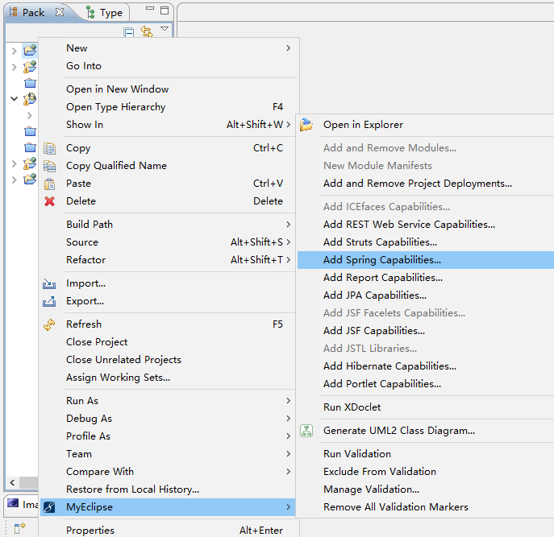
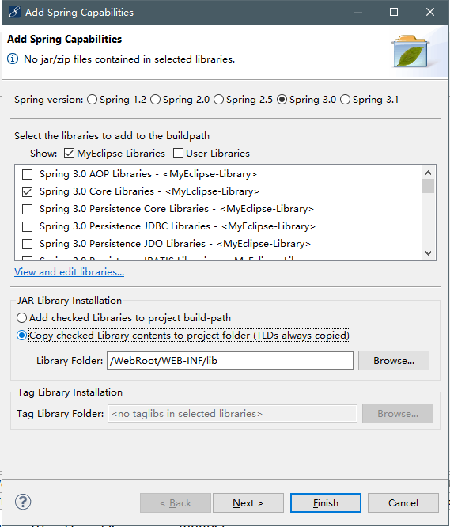
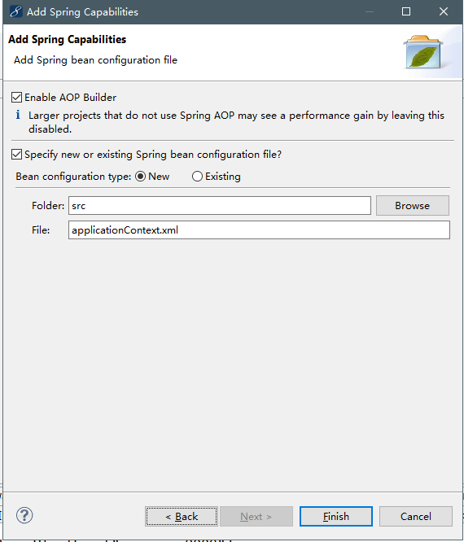

#初识Spring

---

#####spring特点及体系结构

优势:

* 方便解耦，简化开发
* AOP编程的支持
* 声明式事务的支持
* 方便程序的测试
* 方便集成各种优秀的框架
* 降低JavaEE API的使用难度

---

#####理解IoC

控制反转(Inversion of Control,Ioc)是spring容器的内核，AOP，声明式事务等功能都是在此基础上研发出来的，所谓IoC，就是通过容器来控制业务对象之间的以来关系，而非传统实现中的有代码直接控制。applicationContext.xml是Spring的实例配置工程，在程序启东市有BeanFactory实例化工厂加载该文件中所注入的类。

**BeanFactory是一个类工厂，但其与传统的类工厂不同，传统的类工厂仅负责构造一个或几个类的实例，而BeanFactory是类的通用工厂，它可以创建并管理各种类的对象。applicationContext的中文意思是"应用前后关系"。**

---

##### 使用IDE 环境创建Spring工程

1. 打开Myclipse10工具，创建web项目

2. 在工程中添加Spring支持，在工程名上单击右键，选择“MyEclipse”→“Add Spring Capabilities”



3. 在工程中添加Spring3.0 Core Libraries(即IoC)支持，并将Spring的Jar包文件添加到工程的lib目录下。选择Spring3.0版，勾选核心包（Spring 3.0 Core Libraries）。

   

4. 选择applicationContext.xml文件的创建位置（一般位于src下），最后点击“Finish”即可创建完成。

   

5. 完成

   

---

##### 简单的Spring依赖注入

在applicationContext.xml文件中使用Bean属性注入对象。首先，创建一个Student JavaBean，添加stuId和name两个属性；然后，在Spring配置文件中注入Student类；最后，在控制台输出结构

1. 在工程中创建一个Student.java类

   ```java
   pack com.proc.bean
   public class Student
   {
       private int stuId;
       private String name;
       public int geStuId()
       {
           return stuId;
       }
       public void setStuId(int stuId)
       {
           this.stuId = stuId;
       }
       ...
   }
   ```

2. 在applicationContext.xml文件中注入Student类

   ```java
   //id代表实例化名 class代表选择要实例化的类
   <bean id = "StudentBean" class = "com.proc.bean.Student"></bean>
   ```

3. 使用ApplicationContext对象获得类的实例

   ```java
   package com.proc.test
   import org.springframework.context.ApplicationContext;
   import org.springframework.context.support.ClassPathXmlApplication;
   import com.proc.bean.Student;
   public class TestMain{
       public static void main(String[] args) {
          //启动spring，装载上下文
          ApplicationContext context = new 				         ClassPathXmlApplicationContext("applicationContext.xml");
          //获得配置的Student实例
           Student stu = (Student)context.getBean("StudentBean");
           Sysyem.out.println(stu);
       }
   }
   ```

4. 输出结果为:`com.proc.bean.Student@9dae16a`

---

##### set注入

*在applicationContext.xml文件中，不仅能完成对象的初始化，还可以动态配置属性信息。*

1. 在StudentBean中赋值stuId和name的属性

   ```
   <bean id = "studentBean" class = "com.proc.Student">
   	<property name = "name" value = "Jack"></property>
   </bean>
   ```

2. 在测试类中调用getName()方法

   ```
   System.out.pringln(stu.getName();)
   ```

3. 输出`Jack`。

---

##### 理解Bean的ref属性

在类和类之间少不了依赖关系。例如，在一个类中对另一个类的引用。

```
public class Car{...}
public class Employee{
    private Car car;
    ...
}
```

员工类以来车类，在property属性中提供了ref属性来解决对其他类依赖的问题。

1. 创建Phone类，并添加call方法

   ```java
   package com.proc.bean
   public class Phone{
       private String massage;
       public void setMassage(String massage)
       {
           this.massage = massage;
       }
       public void call(){
           System.out.pringln(massage);
       }
   }
   ```

2. 修改Student类，添加对Phone的依赖

   ```java
   public class Student
   {
       private Phone phone;
       public Phone getPhone(){
           return phone;
       }
       public void setPhone(Phone phone){
           this.phone = phone;
       }
   }
   ```

3. 在applicationContext.xml文件中注入Phone类，并在Student Bean中使用ref引用Phone Bean

   ```java
   <bean id = "phoneBean" class = "com.proc.bean.Phone">
   	<property name = "massage" value = "toJack:早上好，Jack！"></property>
   </bean>
   <bean id = "studentBean" class = "com.proc.bean.Student">
   //ref是引用对象方式
   <property name = "phone" ref = "phoneBean"></property>
   </bean>
   ```

4. 在testMain类中重新调用call方法

   ```
   Student stu = (Student)context.getBean("studentBean");
   stu.getPhone().call();
   ```

5. 输出:`toJack:早上好，Jack！`

   <!--如果要在applicationContext.xml文件中对另一个对象引用，那么要在本对象中实现另一个对象的set方法-->

---

##### 注入集合对象

在property属性中，我们不仅可以将String，int等字面值注入到Bean中，还可以将java.util包中的集合类型注入到Bean中。它主要包括List，Set，Map，Properties类型，Spring为这些集合类型提供了专门的配置元素标签。

在property属性中，我们不仅可以将String，int等字面值注入到Bean中，还可以将java.util包中的集合类型注入到Bean中，它主要包括List，Set，Map和Properties类型，Spring为这些集合类型提供了专门的配置元素标签。

1. 创建Boss类，添加集合类型的属性

   ```java
   package com.proc.bean
   import java.util.*;
   public class Boss{
       private List favorites = new ArrayList();
       private Map<String,String> jobTime = new HashMap<String,String>();
       //get/set
   }
   ```

2. 在applicationContext.xml文件中注入Boss类，并对集合属性静态赋值，代码如下

   ```java
   <bean id = "bossBean" class = "com.proc.boss">
   <property name = "favorites">
   	<list>
   		<value>看报</value>
   		<value>赛车</value>
   		<value>打游戏</value>
   	</list>
   </property>
   <property name = "jobTime">
   	<map>
   		<entry>
   			<key>
   				<value>AM</value>
   			</key>
   			<value>会见客户</value>
   		</entry>
   	</map>
   </property>
   </bean>
   ```

3. 在测试类中调用集合的返回方法

   ```java
   Boss boss = context.getBean("bossBean",Boss.class);
   System.out.println("老板喜欢:"+boss.getFavorites().get(0));
   System.out.pringln("老板上午的工作是:"+boss.getJobTime().get("AM"));
   ```

4. 输出结果

   ```
   老板喜欢:看报
   老板上午的工作是:会见客户
   ```


问题:

关于ref属性：

当一个类中有另一个类的引用时会用到ref属性。

```
public class employee{
    private Department dep;
    //get,set方法
}
```

当spring整合struts时，如果action类中引用了另一个类，那么由于页面直接访问action中的方法，导致action类并没有getBean()初始化，所以无法使用引用的类，解决方法是:在struts2.xml文件中，action中的class属性的值写为applicationContext.xml中注入的action类的bean的id