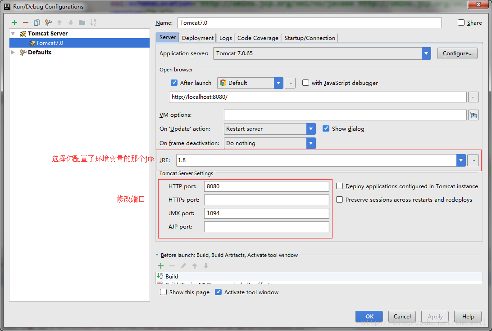
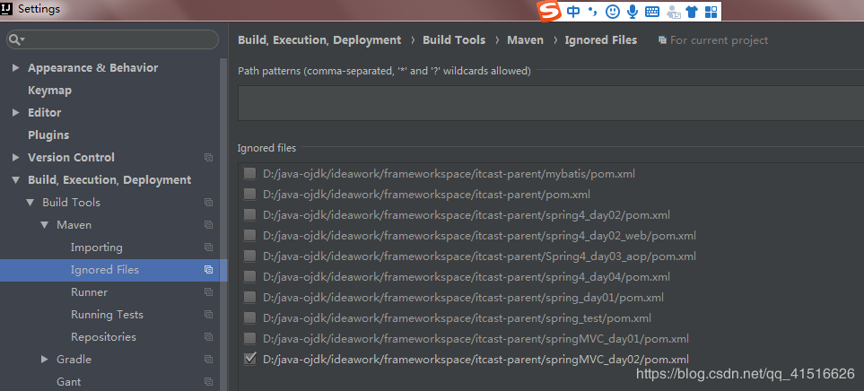

# Idea的maven配置出现的错误

##一

在配置完web项目后将其部署到tomcat时出现错误:`Application Server was not connected before run configuration stop, reason: Unable to ping server at localhost:1099`

原因:

上网查了查，发现大家给了这么几个解决方法

1. 换端口

有些人说是端口被占用了，换了一个就可以了，不过我自己试了下，貌似没用

2. JVM的内存不够

这个我感觉可能性不大，事实也证明至少我这个不是这个错
下面就是我这一次出现问题的真正原因：

3. java环境没有配置

Tomcat是需要jre的，如果你的JAVA_HOME没有配置，那肯定是起不来的
不过我的java环境是配置过的，但是这个IDEA很奇怪，不止要JAVA_HOME，还要一个JRE_HOME,你需要再在环境变量里面把你的JRE_HOME也配置一下
如果这样做了，问题还是没解决，那还是有几种可能的

1. 你的电脑里有多个jre，在IDEA里给Tomcat选jre时候必须要选你配置了环境变量的那个

   

2. 这种情况也就是我的这种情况，在选择jre时候或者是在配置JRE_HOME时候，你必须要选jdk目录下的那个jre，也就是说你要选C:\Program Files\Java\jdk1.8.0_121\jre而不是C:\Program Files\Java\jre1.8.0_131

3. 如果还没有解决，我建议你看一下tomcat的bin目录下的setclasspath.bat文件，看一下下面加粗的两行是不是还是不对，如果不对的话，改一下，就可以运行了

   rem the License. You may obtain a copy of the License at 
   rem 
   rem http://www.apache.org/licenses/LICENSE-2.0 
   rem 
   rem Unless required by applicable law or agreed to in writing, software 
   rem distributed under the License is distributed on an “AS IS” BASIS, 
   rem WITHOUT WARRANTIES OR CONDITIONS OF ANY KIND, either express or implied. 
   rem See the License for the specific language governing permissions and 
   rem limitations under the License.

   rem ————————————————————————— 
   rem Set JAVA_HOME or JRE_HOME if not already set, ensure any provided settings 
   rem are valid and consistent with the selected start-up options and set up the 
   rem endorsed directory. 
   rem —————————————————————————

   set JAVA_HOME=C:\Program Files\Java\jdk1.8.0_121 
   set JRE_HOME=C:\Program Files\Java\jdk1.8.0_121\jre

   rem Make sure prerequisite environment variables are set

   rem In debug mode we need a real JDK (JAVA_HOME) 
   if “”%1”” == “”debug”” goto needJavaHome

   rem Otherwise either JRE or JDK are fine 
   if not “%JRE_HOME%” == “” goto gotJreHome 
   if not “%JAVA_HOME%” == “” goto gotJavaHome 
   echo Neither the JAVA_HOME nor the JRE_HOME environment variable is defined 
   echo At least one of these environment variable is needed to run this program 
   goto exit

   :needJavaHome 
   rem Check if we have a usable JDK 
   if “%JAVA_HOME%” == “” goto noJavaHome 
   if not exist “%JAVA_HOME%\bin\java.exe” goto noJavaHome 
   if not exist “%JAVA_HOME%\bin\javaw.exe” goto noJavaHome 
   if not exist “%JAVA_HOME%\bin\jdb.exe” goto noJavaHome 
   if not exist “%JAVA_HOME%\bin\javac.exe” goto noJavaHome 
   set “JRE_HOME=%JAVA_HOME%
   ————————————————
   版权声明：本文为CSDN博主「simple-soul」的原创文章，遵循 CC 4.0 BY-SA 版权协议，转载请附上原文出处链接及本声明。
   原文链接：https://blog.csdn.net/UmGsoil/article/details/73250121

## 二.Maven项目中右边的maven Projects中子项目出现灰色

原因:忽略了maven模块

解决方法:在idea中maven的setting中找到ignored files,看右边的面板中是否将变灰的maven模块忽略了。我的模块变灰就是因为这个原因，Settings–>Maven–>Ignored Files 看看是不是有勾选的。去掉就好了
————————————————
版权声明：本文为CSDN博主「宋青书」的原创文章，遵循 CC 4.0 BY-SA 版权协议，转载请附上原文出处链接及本声明。
原文链接：https://blog.csdn.net/qq_41516626/article/details/85331685

## Access denied for user 'root'@'localhost' 

此时是配置的数据库密码错误，如果是新下载的mysql默认密码是root时也会报这个错误，这时需要重新设置一下mysql的密码，cmd里设置，想要在cmd里有mysql的命令需要配置环境变量。记得修改完密码后要把原来连接的密码也要修改，不然还是会报这个错。https://www.jianshu.com/p/b1dd63a9b183（正确认识这个错误）

**我的错误是yml文件的password属性写错成了data-password，嗯是的，属性写错了..........**