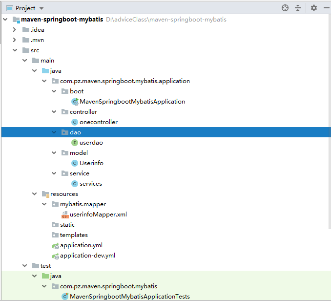

# SpringBoot模式配置(Idea)

###配置步骤

选中对象或者关键字，然后ALT+ENTER可以自动导入包或者提示

 *yml端口-----0~65535*

*创建的项目名称不能有~~Tom关键字~~?* 不能有大写字母


---

1. 打开Idea，新建文件，选择Spring Initializr。JDK选择1.8——>next。自定义Group和Artifact——>next

2. 选择Web的Spring Web——>next

3. install

4. application.properties里可进行设置<!--server.port=9090代表把tomcat默认端口设置为9090-->

5. resources下的application有文件**application.yml**和**application---properties**，可以有多个yml文件

   application.yml写法(冒号后面有空格)

   ```
   server:
   	port: 80
   ```

   一般开发模式中resources中会有多个yml文件，如`application.yml,application-dev.yml,application-product.yml,application-test.yml`文件，用于在不同环境(测试环境，开发环境)等切换相应配置。如在application-dev.yml文件中配置:

   ```
   server:
     port: 9191
   ```

   那么在application.yml文件中

   ```
   spring:
     profiles:
       active: dev
   ```

   默认tomcat端口号就会变成9191

6. 在Java包中的默认包中创建controller

   在类上注解@RestController

   在方法上注解@RequestMapping("/hello")，意思是在方法中返回的是字符串，不能进行页面跳转，如果在类上注解@Controller，则返回的是页面

   SpringBoot默认不支持JSP

   对于@SpringBootApplication来说，它只能扫描到同包或子包的controller，如果controller在不同包，则需要使用scanBasePackages属性

   ```
   @SpringBootApplication(scanBasePackages="com.example.demo1)
   ```

   左侧栏中的设置按钮(减号旁边)的Flatten packages可以把包名设置为平铺形式。(com.pz.scce.test)如此

---

### springboot访问html

1. 打开idea，选择springweb，进入

2. 配置pom.xml文件，添加依赖

   ```
   <dependency>
        <groupId>org.springframework.boot</groupId>
        <artifactId>spring-boot-starter-thymeleaf</artifactId>
   </dependency>
   ```

3. 配置application.yml文件

4. 把要访问的图片和相关静态资源放在resources的static目录下，这是默认返回视图的文件位置

<!--注 :只能在“resources”目录下创建文件，因为springboot只在它下面扫描-->

5. 编写controller文件，@RestController用于返回JSON数据，而@Controller用于返回页面
6. 访问页面

---

SpringBoot里面没有我们之前常规Web开发的WebContent（WebApp），它只有src目录

在src/main/resources下面有两个文件夹，static和templates。springboot默认static中放静态页面，而templates中放动态页面。

**静态页面:**直接在static放一个hello.html，然后输入`http://localhost:8080/hello.html`便能直接访问，也可以通过Controller跳转到页面访问。如:

```
@Controller
public class HelloController{
	@RequestMapping("/hi")
	public String sayHello(){
        return "hello.html";
	}
}
```

此时可以直接输入`http://localhost:8080/hi`就可以成功访问

**动态页面:**动态页面需要先请求服务器，访问后台应用程序，然后再转向到页面，比如访问JSP。当然SpringBoot不建议使用JSP，默认使用Thymeleaf来做动态页面。

现在pom中要添加Thymeleaf组件

```
<dependency>  
    <groupId>org.springframework.boot</groupId>  
    <artifactId>spring-boot-starter-thymeleaf</artifactId>  
</dependency>  
```

我们可以现在templates文件夹中也新建一个hello.html但内容不同，然后先试着直接访问该页面。

`http://localhost:8080/hello.html`,结果是访问到的是static静态文件夹的那个hello.html。

然后再试着用Controoler访问。`http://localhost:8080/hi`,此时页面500，无法访问到hello.html的页面。这是因为静态页面的return默认是跳转到了/static/hello.html，而当在pom.xml中引入了thymeleaf组件，动态跳转回覆盖默认的静态跳转，默认会跳转到/templates/hello.html。注意的一点是，两者的return代码也有区别，动态的并没有html后缀。

也就是我们要这样改Controller

```
@Controller
public class HelloController{
    @RequestMapping("/hi")
    public String sayHello(){
        return "hello";
    }
}
```

就可以成功跳转了。

然后返回一点数据在前端利用Thymeleaf来拿

```
@Controller
public class HelloController{
    @RequestMapping("/hi")
    public ModelAndView sayHello(){
        ModelAndView mav = new ModelAndView();
        mav.setViewName("hello");
        mav.addObject("key",123456);
        return mav;
    }
}
```

```
<!DOCTYPE html>
<html>
<head>
<meta charset="UTF-8"/>
<title>Insert title here</title>

</head>
<body>
<h1>this is the hello.html in templates</h1>
<span th:text="${key}"></span>  
</body>
</html>
```

最后则会在页面上显示12345，如果不想返回视图可以使用@RestController

如果用了静态模板你还想返回static中的页面，那么就要使用重定向：

如果在动态页面时还想要跳转到/static/index.html，可以使用重定向return “redirect:/index.html”。

提示:

1. 拦截的url最好不要和视图重合，否则会抛出Circular view path异常

```
@Controller
public class hellocontroller{
    @RequestMapping("/hello")
    public String sayhi(){
        return "hello.html";
    }
}
```

2. 每次改完都要重新停止应用，再重新启动很麻烦，但springboot有个叫热部署的东西，就是说在项目中修改代码后不用再重新停止应用再重新启动，可以自动重启。这里我们使用devtools

   ①pom.xml文件中引入devtools依赖

   ```
   <dependency>
   	<groupId>org.springframework.boot</groupId>
   	<artifactId>spring-boot-devtools</artifactId>
   	<option>true</option>
   	//option=true，依赖不会传递，该项目依赖devtools
   </dependency>
   ```

   ②在application.properties文件中码上以下内容

   ```
   spring.thymeleaf.cache=true //缓存
   spring.devtools.restart.enabled=true //开启
   spring.devtools.restart.additional-paths=src/main/java //监听目录
   ```

   以上均来自https://www.cnblogs.com/wangshen31/p/8727359.html

---

### springBoot兼容JSP

1. 加入内置jsp引擎**tomcat-embed websocket**,可以直接在maven页面上搜索

   ```
    <dependency>
         <groupId>org.apache.tomcat.embed</groupId>
         <artifactId>tomcat-embed-jasper</artifactId>
    </dependency>
   ```

2. application.yml文件

   **此处suffix直接为返回的值添加后缀jsp，故在controller返回页面时直接**`return "index";`**即可**

   ```
    mvc:
       view:
         prefix: /WEB-INF/view/
         suffix: .jsp
   ```

3. ```
   <dependency>
               <groupId>org.springframework.boot</groupId>
               <artifactId>spring-boot-starter-test</artifactId>
               <scope>test</scope>
    </dependency>
   ```

   **可以删掉**(删掉test以来也要把test包删掉，不然打不了包)

4. project structure-->Facets-->指明name

5. 所有的jsp文件都在WEB-INF的view文件中管理

### 使用外部tomcat

使用的外部tomcat时，访问项目时没有写项目名称直接访问对应controller方法反而可以访问进去

（检查访问地址是否写正确，地址应该为controller的路径加上RequestMapping的路径。  ）

application.java文件的包必须是项目下的父路径，其他类的包路径必须是其子路径，如：   

1. 新建文件时Packaging中选择的是war

2. 创建webapp

   * 进入pom.xml文件中，选择dependencies右键Diagrams选择第二个可以查看关联关系视图

   * 在denpendency中groupId为org。springframework。boot中添加标签\<exlusions\>排除依赖使其依赖于外部tomcat

   * ```
     <dependency>
         <groupId>org.springframework.boot</groupId>
         <artifactId>spring-boot-starter-web</artifactId>
     
         <!--排除掉web依赖的内置tomcat使用外部我们自己安装的tomcat-->
     	<exclusions>
              <exclusion>
                   <artifactId>spring-boot-starter-tomcat</artifactId>
                      <groupId>org.springframework.boot</groupId>
              </exclusion>
          </exclusions>            
     
     </dependency>
     
     ```

     注：使用外部的tomcat时yml配置的端口就无用了，因为它是管理内部的tomcat

     想使用外部tomcat要重写一个ServletIntializer类继承SpringBootServletInitializer

3. 添加兼容jsp的dependency

   ```
   <dependency>
   
               <groupId>org.apache.tomcat.embed</groupId>
   
               <artifactId>tomcat-embed-jasper</artifactId>
   
               <scope>provided</scope>
   
           </dependency>
   ```

   

4. yml中(prefix中是什么文件包webapp下就创建什么名称的包)

   ```
   spring:
   	mvc:
   		view:
   			prefix: /WEB-INF/jsp
   			suffix: .jsp
   ```

5. webapp/WEB-INF/jsp包创建在src下的main包中，与java和resources同级，同时不用配置webxml文件。如果在yml文件中配置了后缀，就不用在controller返回页面时添加后缀。在访问controller时记得名称写对

6. project structure-->Facets-->指明name

7. 点击Idea右侧配置tomcat

#### 排除依赖

\<exclusions\>

```
<exclusions>
     <exclusion>
          <artifactId></artifactId>
          <groupId></groupId>
     </exclusion>
 </exclusions>   
```

###长连接jetty(适合聊天软件)

只需要在pom文件中做一个排除和一个依赖(排除内置tomcat依赖和新增加Jetty依赖)

```
//排除内置tomcat依赖
<dependency>
	<groupId>org.springframwrork.boot</groupId>
	<artifactId>spring-boot-starter-web</artifactId>
	<exclusions>
		<exclusion>
			<groupId>
			org.springframework.boot
			</gourpId>
			<artifactId>spring-boot-starter-tomcat</artifactId>
		</exclusion>
	</exclusions>
</dependency>

//增加jetty依赖
<dependency>
	<groupId>org.springframework.boot</groupId>
	<artifactId>spring-boot-starter-jetty</artifactId>
</dependency>
```


## 分层

**ctrl+shift+m提示代码**

1. 打开Idea，选择maven，不选择模板（创建完成后src可删可不删，建议删）创建父项目**app-maven-base**

2. 父项目右键New Module，选择Maven的web模板(**右键的是父项目不是File**)

3. 创建**app-maven-web**(**名字随意取——》next——》next——》...

4. 列表栏会出现多个pom.xml。父项目pom.xml中配置了\<modules\>,代表父项目，关联了app-maven-web

5. 创建quickstart的**app-maven-service**模板（父项目的\<modules\>也自动关联了service）

6. 创建**app-maven-dao**模块，也会自动关联

7. 创建**app-maven-model**模块

   在不同模块中访问不同模块的类属性方法，可以再相应模块的pom.xml中添加\<dependency\>相应模块的名称Id，当多个模块依赖于一个模块时会重复依赖。这时可以dao依赖model，service依赖dao，controller依赖service，web依赖controller。

8. 在依赖完成后clean后再install

### Spring整合mybatis

1. Spring Initializr

2. * developer Tools选择Lombol(需要一个jar包，作用少写代码。。。。。在封装类中家@Getter/@Setter注解，在编译期有效，自动生成get/set方法)，<!--file中的setting搜索Lombok，install。-->
   * Web选择Spring Web
   * SQL选择MySql Driver和MyBatis Framework---》next

3. 数据库创建表

4. application改成yml文件---加上个dev，dev中配置相关信息

   ```
   server:
     port: 7070
   
   spring:
     datasource:
       username: root
       password: 123456
       url: jdbc:mysql://localhost:3306/pz?&serverTimezone=UTC
       driver-class-name: com.mysql.cj.jdbc.Driver
       hikari:
         connection-timeout: 10000//默认连接时间
   mybatis:
     mapper-locations: mybatis/mapper/*    //检索mapper包下的所有xml
     type-aliases-package: com.pz.maven.springboot.mybatis.application.model.Userinfo
   ```

5. resources下创建mapper文件和mybatis文件，mapper文件下创建userinfoMapper.xml文件

6. 配置Mapper.xml文件，可以直接反响映射java文件

   <!--namespace指定的dao的路径-->

   ```
   <?xml version="1.0" encoding="UTF-8"?>
   <!DOCTYPE mapper PUBLIC "-//mybatis.org//DTD Mapper 3.0//EN"
           "http://mybatis.org/dtd/mybatis-3-mapper.dtd">
   
   
   <mapper  namespace="com.pz.maven.springboot.mybatis.application.dao.userdao">
       <resultMap id="baseResultMap" type="com.pz.maven.springboot.mybatis.application.model.Userinfo">
           <id column="id" property="id"/>
           <result column="sex" property="sex"/>
           <result column="name" property="name"/>
           <result column="age" property="age"/>
       </resultMap>
   
       <select id="queryUserList" resultMap="baseResultMap">
                select *
                from t_userinfo
         </select>
   
   </mapper>
   ```

7. dao

   ```
   package com.pz.maven.springboot.mybatis.application.dao;
   
   import org.springframework.stereotype.Component;
   
   @Component
   public interface userdao {
       public List<UserInfo> queryUserList();
   }
   
   ```

8. service

   ```
   @Service
   @Transactional(readOnly=true)//表示事务只读
   public class services {
       @Autowired
       private UserInfoDao userInfoDao;
   
   }
   ```

9. controller

   ```
   @RestController
   public class onecontroller {
       @Autowired
       private UserInfoService userInfoservice;
       @RequestMapping("userList")
       public Object queryUserList(){
   
       }
   }
   ```

   dao类是个接口，没有实现类，不能依赖,所以application中

   ```
   @SpringBootApplication(scanBasePackages = "com.pz.maven.springboot.mybatis.application")
   @MapperScan(basePackages = "com.pz.maven.springboot.mybatis.application.dao")
   springboot动态产生一个实现类
   @EnableTransactionManage //想要加上事务，然后在service上添加相应事务
   public class MavenSpringbootMybatisApplication {
   
       public static void main(String[] args) {
           SpringApplication.run(MavenSpringbootMybatisApplication.class, args);
       }
   
   }
   
   ```

   目录结构如下: