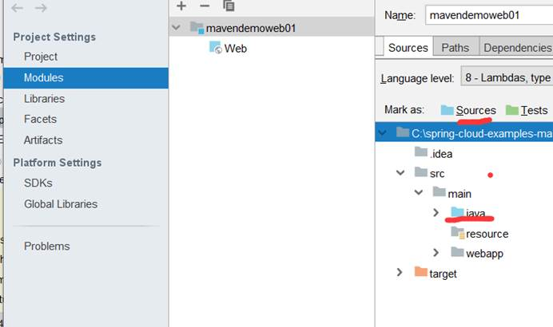

# maven配置

###环境配置

1. 解压apache-maven-3.6.2文件

2. 配置环境变量

3. D:\IDEA\apache-maven-3.6.2\conf中的setting.xml配置

   ```
   <localRepository>D:\maven_repository</localRepository>
     
     ----------------------------------------------
     
     //<mirrors>中的
     <mirror>
         <id>alimaven</id>
         <name>aliyun maven</name>
         <url>
             http://maven.aliyun.com/nexus/content/groups/public/
         </url>
         <mirrorOf>*</mirrorOf>        
       </mirror>
    <mirror>
         <id>nexus</id>
         <name>nexus</name>
         <url>
             http://localhost:8081/repository/maven-public/
         </url>
         <mirrorOf>external:*</mirrorOf>        
       </mirror>
   
   ```

### maven目录结构

对于maven来说，它有一个核心配置文件--pom.xml

1. 创建maven文件

2. 第一级目录的src和pom.xml

3. src目录下创建main

4. main中创建自定义包（java-com-sand）

5. 执行maven

   cmd中找到maven文件路径。输入指令（mvn -package）

### maven创建web项目

1. 创建maven archetype-web
2. 在main创建Java目录
3. Maven的网站 找servlet jsp  jstl   的坐标将 坐标 拷贝到 项目的pom文件中  创建 一个Servlet让该Servlet继承HttpServlet  重写service方法   在该Servlet类上加上@WebServlet注解



### IdeaMaven创建web项目并部署

1. 打开idea

2. File——>project——>选择Maven的archetype-webapp(不要选错)——>next

3. GroupId:一般为公司名(com.pz)，ArtifactId:项目名——next

4. Maven home directory：(D:\IDEA\apache-maven-3.5.0\apache-maven-3.5.0)

   User settings file：D:\IDEA\apache-maven-3.5.0\apache-maven-3.5.0\conf\settings.xml

   Local repository：D:\maven_repository

5. 项目名和路径

6. 如果事先没有生成jar包，点击右侧工具栏的Maven的install或者package

7. File中的other settings的settings for new projects可以声明全局。

8. src包下右键创建Java包

9. 右键Java包点击Mark Directory as中的Sources root可以使Java包编程蓝色可存储java类文件的包

10. java包中创建servlet类

11. 百度搜索maven进入官网，搜索servlet进入API复制dependency添加到pom.xml中的dependencies标签，右侧maven中的Dependencies会自动生成对应jar包

12. 书写完servlet文件点击install生成target，war文件

13. 点击Add Configuration——>点击+号——>添加local的tomcat(注意JRE要配置成有环境变量的jdk，不要默认和其他见maven配置错误信息)三个点`···`选择jdk文件

14. 点击Deployement，添加artifact的two:war exploded点击OK然后运行